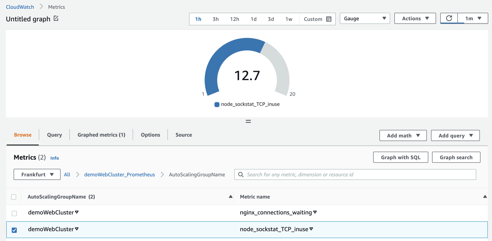

## Introduction

Quite a few workloads may still require deployment to virtual machines instead of container orchestration platforms, yet still, have to be intelligently autoscaled. For example, a compound workload running on a stateless EC2 instance in an EC2 Autoscaling Group may emit various Prometheus-compatible metrics via Prometheus exporters. A simplified model for such a use case could be an Amazon Linux 2 instance running a node-exporter, exposing OS metrics, and a workload application delivering its own set of Prometheus-compatible metrics.

This post will illustrate how to configure an EC2 Autoscaling Group to use these metrics within Target Tracking Scaling Policies with the help of the AWS Cloudwatch agent.

Pulumi IaC will help us bring up our infrastructure on the AWS Cloud. Check out [pulumi.com](https://pulumi.com) if you still need to become familiar with it. You can deploy this demo stack using the Pulumi button below.

[](https://app.pulumi.com/new?template=https://github.com/svodwood/pulumi-ec2-cloudwatch-prometheus-autoscaling)

You may find the source code for this demo in [this Github repo](https://github.com/svodwood/pulumi-ec2-cloudwatch-prometheus-autoscaling).

## What We Are Going To Build

We will create a pair of identical EC2 instances running in an EC2 Autoscaling Group behind a public Application Load Balancer, each running a demo web workload and exposing node-exporter and web-server metrics. Next, AWS Cloudwatch agent will scrape the metrics and publish them to Cloudwatch. Finally, a Target Tracking Scaling Policy will govern autoscaling decisions based on a customized metric specification.

To start building, we are going to need to meet the prerequisites:
1. An AWS account with a named AWS CLI profile configured.
2. A working Pulumi environment.

## Basic Infrastructure 

First, we will construct a VPC consisting of a pair of public subnets and a pair of private subnets:

```python
"""
vpc.py
"""
# Create a VPC and Internet Gateway:
demo_vpc = ec2.Vpc("demo-vpc",
    cidr_block=demo_vpc_cidr,
    enable_dns_hostnames=True,
    enable_dns_support=True,
    tags={**general_tags, "Name": f"demo-vpc-{config.region}"}
)

demo_igw = ec2.InternetGateway("demo-igw",
    vpc_id=demo_vpc.id,
    tags={**general_tags, "Name": f"demo-igw-{config.region}"},
    opts=pulumi.ResourceOptions(parent=demo_vpc)
)

# Create a default any-any security group for demo purposes:
demo_sg = ec2.SecurityGroup("demo-security-group",
    description="Allow any-any",
    vpc_id=demo_vpc.id,
    ingress=[ec2.SecurityGroupIngressArgs(
        description="Any",
        from_port=0,
        to_port=0,
        protocol="-1",
        cidr_blocks=["0.0.0.0/0"],
        ipv6_cidr_blocks=["::/0"],
    )],
    egress=[ec2.SecurityGroupEgressArgs(
        from_port=0,
        to_port=0,
        protocol="-1",
        cidr_blocks=["0.0.0.0/0"],
        ipv6_cidr_blocks=["::/0"],
    )],
    tags={**general_tags, "Name": f"demo-sg-{config.region}"},
    opts=pulumi.ResourceOptions(parent=demo_vpc)
)

# Create subnets:
demo_azs = get_availability_zones(state="available").names
demo_public_subnets = []
demo_private_subnets = []

for i in range(2):
    prefix = f"{demo_azs[i]}"
    
    demo_public_subnet = ec2.Subnet(f"demo-public-subnet-{prefix}",
        vpc_id=demo_vpc.id,
        cidr_block=demo_public_subnet_cidrs[i],
        availability_zone=demo_azs[i],
        tags={**general_tags, "Name": f"demo-public-subnet-{prefix}"},
        opts=pulumi.ResourceOptions(parent=demo_vpc)
    )
    
    demo_public_subnets.append(demo_public_subnet)

    demo_public_route_table = ec2.RouteTable(f"demo-public-rt-{prefix}",
        vpc_id=demo_vpc.id,
        tags={**general_tags, "Name": f"demo-spoke-rt-{prefix}"},
        opts=pulumi.ResourceOptions(parent=demo_public_subnet)
    )
    
    demo_public_route_table_association = ec2.RouteTableAssociation(f"demo-public-rt-association-{prefix}",
        route_table_id=demo_public_route_table.id,
        subnet_id=demo_public_subnet.id,
        opts=pulumi.ResourceOptions(parent=demo_public_subnet)
    )

    demo_public_wan_route = ec2.Route(f"demo-public-wan-route-{prefix}",
        route_table_id=demo_public_route_table.id,
        gateway_id=demo_igw.id,
        destination_cidr_block="0.0.0.0/0",
        opts=pulumi.ResourceOptions(parent=demo_public_subnet)
    )

    demo_eip = ec2.Eip(f"demo-eip-{prefix}",
        tags={**general_tags, "Name": f"demo-eip-{prefix}"},
        opts=pulumi.ResourceOptions(parent=demo_vpc)
    )
    
    demo_nat_gateway = ec2.NatGateway(f"demo-nat-gateway-{prefix}",
        allocation_id=demo_eip.id,
        subnet_id=demo_public_subnet.id,
        tags={**general_tags, "Name": f"demo-nat-{prefix}"},
        opts=pulumi.ResourceOptions(depends_on=[demo_vpc])
    )

    demo_private_subnet = ec2.Subnet(f"demo-private-subnet-{prefix}",
        vpc_id=demo_vpc.id,
        cidr_block=demo_private_subnet_cidrs[i],
        availability_zone=demo_azs[i],
        tags={**general_tags, "Name": f"demo-private-subnet-{prefix}"},
        opts=pulumi.ResourceOptions(parent=demo_vpc)
    )
    
    demo_private_subnets.append(demo_private_subnet)

    demo_private_route_table = ec2.RouteTable(f"demo-private-rt-{prefix}",
        vpc_id=demo_vpc.id,
        tags={**general_tags, "Name": f"demo-private-rt-{prefix}"},
        opts=pulumi.ResourceOptions(parent=demo_private_subnet)
    )
    
    demo_private_route_table_association = ec2.RouteTableAssociation(f"demo-private-rt-association-{prefix}",
        route_table_id=demo_private_route_table.id,
        subnet_id=demo_private_subnet.id,
        opts=pulumi.ResourceOptions(parent=demo_private_subnet)
    )

    demo_private_wan_route = ec2.Route(f"demo-private-wan-route-{prefix}",
        route_table_id=demo_private_route_table.id,
        nat_gateway_id=demo_nat_gateway.id,
        destination_cidr_block="0.0.0.0/0",
        opts=pulumi.ResourceOptions(parent=demo_private_subnet)
    )
```

Second, let's create an Application Load Balancer, a Target Group and Listener:
```python
"""
alb.py
"""
# Create a load balancer:
demo_alb = lb.LoadBalancer("demo-alb",
    internal=False,
    load_balancer_type="application",
    security_groups=[demo_sg.id],
    subnets=demo_public_subnets,
    enable_deletion_protection=False,
    tags={**general_tags, "Name": "demo-alb"}
)

# Create a target group:
demo_target_group = lb.TargetGroup("demo-target-group",
    port=80,
    protocol="HTTP",
    vpc_id=demo_vpc.id,
    tags={**general_tags, "Name": "demo-alb"},
    health_check=lb.TargetGroupHealthCheckArgs(
        enabled=True,
        healthy_threshold=3,
        interval=10,
        protocol="HTTP",
        port="80"
    ),
    opts=pulumi.ResourceOptions(parent=demo_alb)
)

# Create a listener:
demo_listener = lb.Listener("demo-listener",
    load_balancer_arn=demo_alb.arn,
    port=80,
    protocol="HTTP",
    default_actions=[lb.ListenerDefaultActionArgs(
        type="forward",
        target_group_arn=demo_target_group.arn,
    )],
    opts=pulumi.ResourceOptions(parent=demo_alb)
)
```

With our basic infrastructure completed, we can continue configuring our EC2 web server, which will host all our custom configurations.

## Nginx, Node Exporter, Nginx Prometheus Exporter, Cloudwatch Agent - Oh My!

The stack extensively uses AWS SSM Parameter Store, where we push all relevant configuration parameters. As a result, an Amazon Linux 2 instance configuration using user data during boot is effortless - it is simply a matter of fetching the correct parameter with AWS CLI:

```bash
aws ssm get-parameter --name {{ cwa_prometheus_parameter_path }} --region {{ region }} --with-decryption --output text --query Parameter.Value > /opt/aws/amazon-cloudwatch-agent/etc/prometheus.yml
```

AWS SSM Parameter Store is also one of the easiest ways to configure AWS Cloudwatch agent natively, but we will get to this later. Onwards!

Our primary web server workload will be represented by an Nginx server, exposing a default page over port 80 and emulating a workload application. We will use Amazon Linux 2 x86_64 as our OS. On the observability layer, we will install Node Exporter to expose OS-level metrics and Nginx Prometheus Exporter to query the Nginx stub_status endpoint and convert this information into a Prometheus-compatible set of metrics. Both will run on every EC2 instance in the Autoscaling Group as system processes.

Let's take care of enabling the stub_status Nginx module:
```python
"""
nginx_config.py
"""
demo_nginx_stub_status_configuration_file = Template("""
server {
        listen 127.0.0.1:{{ port }};
        location = /metrics {
                stub_status;
        }
}
""")
demo_nginx_stub_status_configuration = demo_nginx_stub_status_configuration_file.render(port=nginx_stub_status_port)

demo_nginx_configuration_parameter = ssm.Parameter("demo-nginx-config",
    type="String",
    data_type="text",
    name=nginx_stub_status_config_parameter_path,
    tags={**general_tags, "Name": "demo-nginx-config"},
    value=demo_nginx_stub_status_configuration
)
```
Now, let's define our Cloudwatch agent configuration:
```python
"""
cwa.py
"""
# Cloudwatch Agent configuration, written to SSM parameter store:
demo_cwa_configuration = json.dumps({
	"agent":{
		"metrics_collection_interval":60
	},
	"logs":{
		"metrics_collected":{
			"prometheus":{
				"cluster_name":f"{cluster_name}",
				"log_group_name":f"{cluster_name}Prometheus",
				"prometheus_config_path":"/opt/aws/amazon-cloudwatch-agent/etc/prometheus.yml",
				"emf_processor":{
					"metric_declaration_dedup":True,
					"metric_namespace":f"{cluster_name}_Prometheus",
					"metric_unit":{
						"node_sockstat_TCP_inuse":"Count",
						"nginx_connections_waiting":"Count"
					},
					"metric_declaration":[
						{
							"source_labels":[
								"origin"
							],
							"label_matcher":"^web-server-node-exporter$",
							"dimensions":[
								[
									"AutoScalingGroupName",
									"node"
								],
								[
									"AutoScalingGroupName"
								]
							],
							"metric_selectors":[
								"^node_sockstat_TCP_inuse$"
							]
						},
						{
							"source_labels":[
								"origin"
							],
							"label_matcher":"^web-server-nginx$",
							"dimensions":[
								[
									"AutoScalingGroupName",
									"node"
								],
								[
									"AutoScalingGroupName"
								]
							],
							"metric_selectors":[
								"^nginx_connections_waiting$"
							]
						}
					]
				}
			}
		}
	},
	"metrics":{
		"namespace":f"{cluster_name}_Memory",
		"append_dimensions":{
			"AutoScalingGroupName":"${aws:AutoScalingGroupName}",
			"node":"${aws:InstanceId}"
		},
		"aggregation_dimensions":[
			[
				"AutoScalingGroupName"
			]
		],
		"metrics_collected":{
			"mem":{
				"measurement":[
					{
						"name":"mem_used_percent",
						"rename":"MemoryUtilization",
						"unit":"Percent"
					}
				],
				"metrics_collection_interval":60
			}
		}
	}
})

demo_ssm_cwa_configuration_parameter = ssm.Parameter("demo-cwa-config",
    type="String",
    data_type="text",
    name=cwa_settings_parameter_path,
    tags={**general_tags, "Name": "demo-cwa-config"},
    value=demo_cwa_configuration
)

# Cloudwatch Agent prometheus scrape configuration, written to SSM parameter store:
demo_prometheus_configuration_template = Template("""
global:
  scrape_interval: 1m
  scrape_timeout: 10s
scrape_configs:
  - job_name: Local_NodeExporter_Metrics
    static_configs:
      - targets:
          - 'localhost:9100'
        labels:
          origin: web-server-node-exporter
          AutoScalingGroupName: {{autoscaling_group_name}}
  - job_name: Local_Nginx_Metrics
    static_configs:
      - targets:
          - 'localhost:9113'
        labels:
          origin: web-server-nginx
          AutoScalingGroupName: {{autoscaling_group_name}}
""")

demo_prometheus_configuration = demo_prometheus_configuration_template.render(autoscaling_group_name=cluster_name)

demo_ssm_cwa_promscrape_configuration_parameter = ssm.Parameter("demo-cwa-prom-config",
    type="String",
    data_type="text",
    name=cwa_prometheus_parameter_path,
    tags={**general_tags, "Name": "demo-cwa-prom-config"},
    value=demo_prometheus_configuration
)

# Create a CloudWatch log group for the prometheus metrics:
demo_prom_loggroup = cloudwatch.LogGroup("demo-cwa-log-group",
	name=f"{cluster_name}Prometheus",
	retention_in_days=1,
	tags={**general_tags, "Name": "demo-cwa-log-group"}
)
```
Several noteworthy things happened here. First, we set up the Cloudwatch agent for Prometheus metrics collection. Cloudwatch agent supports standard Prometheus scrape configurations. For example, we are interested in scraping a Node Exporter endpoint on port 9100 and an Nginx Prometheus Exporter endpoint on port 9113. Both jobs will append an "AutoScalingGroupName" tag to the metrics. Second, we configure the ```{"logs":{"metrics_collected":{"prometheus":{}}}}``` stanza to only include "node_sockstat_TCP_inuse" and "nginx_connections_waiting" in our aggregations since, in this case, we are confident we can make autoscaling decisions based on these metrics alone. Notice that we will aggregate both metrics by "AutoScalingGroupName". Finally, to top it off, let's add the built-in memory reporting inside the ```{"metrics":{"metrics_collected":{"mem":{}}}}``` stanza - it's always nice to stay on top of our memory utilization.

With our Cloudwatch agent configuration sorted, let's move on to our EC2 user data.

## Configuring the Instance at Boot

A straightforward way to do this is via a bash script:

```bash
#!/bin/bash
yum update -y

# Install CWA
yum install amazon-cloudwatch-agent -y

# Install Nginx and configure the stub status module
amazon-linux-extras install nginx1.12 -y 
aws ssm get-parameter --name {{ nginx_stub_status_config_parameter_path }} --region {{ region }} --output text --query Parameter.Value > {{ nginx_config_file_path }}

# Add a user to run the exporters
useradd --no-create-home metrics_exporter

# Install Node Exporter
wget https://github.com/prometheus/node_exporter/releases/download/v1.4.0/node_exporter-1.4.0.linux-amd64.tar.gz
tar xzf node_exporter-1.4.0.linux-amd64.tar.gz
cp node_exporter-1.4.0.linux-amd64/node_exporter /usr/local/bin/node_exporter
rm -rf node_exporter-1.4.0.linux-amd64.tar.gz node_exporter-1.4.0.linux-amd64

# Create Node Exporter systemd service
cat << 'EOF' > /etc/systemd/system/node-exporter.service
[Unit]
Description=Prometheus Node Exporter Service
After=network.target
[Service]
User=metrics_exporter
Group=metrics_exporter
Type=simple
ExecStart=/usr/local/bin/node_exporter
[Install]
WantedBy=multi-user.target
EOF

# Install Nginx Exporter
wget https://github.com/nginxinc/nginx-prometheus-exporter/releases/download/v0.11.0/nginx-prometheus-exporter_0.11.0_linux_amd64.tar.gz
tar xzf nginx-prometheus-exporter_0.11.0_linux_amd64.tar.gz
cp nginx-prometheus-exporter /usr/local/bin/nginx-prometheus-exporter
rm -rf nginx-prometheus-exporter_0.11.0_linux_amd64.tar.gz nginx-prometheus-exporter

# Create Nginx Exporter systemd service
cat << 'EOF' > /etc/systemd/system/nginx-prometheus-exporter.service
[Unit]
Description=Prometheus Nginx Exporter Service
After=network.target
[Service]
User=metrics_exporter
Group=metrics_exporter
Type=simple
ExecStart=/usr/local/bin/nginx-prometheus-exporter -nginx.scrape-uri http://127.0.0.1:{{ nginx_stub_status_port }}/metrics -web.listen-address=127.0.0.1:9113
[Install]
WantedBy=multi-user.target
EOF

# Configure CWA
aws ssm get-parameter --name {{ cwa_prometheus_parameter_path }} --region {{ region }} --with-decryption --output text --query Parameter.Value > /opt/aws/amazon-cloudwatch-agent/etc/prometheus.yml
/opt/aws/amazon-cloudwatch-agent/bin/amazon-cloudwatch-agent-ctl -a fetch-config -m ec2 -c ssm:"{{ cwa_settings_parameter_path }}" -s

# Start everything up
systemctl daemon-reload
systemctl enable nginx
systemctl start nginx
systemctl enable node-exporter
systemctl start node-exporter
systemctl enable nginx-prometheus-exporter
systemctl start nginx-prometheus-exporter
```

Here is where we make use of our SSM Parameter Store parameters. Querying is made possible by attaching several managed IAM policies to the instance profile. AWS CLI is available out of the box on an Amazon Linux 2 AMI.

## Houston, we have worming!

Generate some continuous GET requests to the Application Load Balancer public DNS  name, and after a while, we should see some squiggly lines appear in Cloudwatch.

##### Custom Namespaces:


##### Nginx Metric:


##### Node Exporter Metric:


##### High-cardinality Log Streams


## Target Tracking Scaling Policies

Let's imagine a hypothetical situation where we are sure that ```nginx_connections_waiting``` and ```node_sockstat_TCP_inuse``` should have the following average values across our instances in the autoscaling group during production operation at baseline. We are deliberately using some ridiculous values here for the sake of the demo:

```python
target_nginx_connections_waiting = 2
target_node_sockstat_TCP_inuse = 50
```

To quote the official documentation:
>To create a target tracking scaling policy, you specify an Amazon CloudWatch metric and a target value that represents the ideal average utilization or throughput level for your application. Amazon EC2 Auto Scaling can then scale out your group (add more instances) to handle peak traffic, and scale in your group (run fewer instances) to reduce costs during periods of low utilization or throughput.

To achieve this, we will define two Target Tracking scaling policies:

```python
"""
scaling_policies.py
"""
# Define target tracking scaling policies:
nginx_tracking_policy = autoscaling.Policy("demo-nginx-tracking-policy",
    autoscaling_group_name=demo_autoscaling_group.name,
    estimated_instance_warmup=10,
    policy_type="TargetTrackingScaling",
    target_tracking_configuration=autoscaling.PolicyTargetTrackingConfigurationArgs(
        target_value=target_nginx_connections_waiting,
        disable_scale_in=False,
        customized_metric_specification=autoscaling.PolicyTargetTrackingConfigurationCustomizedMetricSpecificationArgs(
            metric_name="nginx_connections_waiting",
            namespace=f"{cluster_name}_Prometheus",
            statistic="Average",
            unit="Count",
            metric_dimensions=[
                autoscaling.PolicyTargetTrackingConfigurationCustomizedMetricSpecificationMetricDimensionArgs(
                    name="AutoScalingGroupName",
                    value=f"{cluster_name}"
                )
            ]
        )
    )
)

netstat_tracking_policy = autoscaling.Policy("demo-netstat-tracking-policy",
    autoscaling_group_name=demo_autoscaling_group.name,
    estimated_instance_warmup=10,
    policy_type="TargetTrackingScaling",
    target_tracking_configuration=autoscaling.PolicyTargetTrackingConfigurationArgs(
        target_value=target_node_sockstat_TCP_inuse,
        disable_scale_in=False,
        customized_metric_specification=autoscaling.PolicyTargetTrackingConfigurationCustomizedMetricSpecificationArgs(
            metric_name="node_sockstat_TCP_inuse",
            namespace=f"{cluster_name}_Prometheus",
            statistic="Average",
            unit="Count",
            metric_dimensions=[
                autoscaling.PolicyTargetTrackingConfigurationCustomizedMetricSpecificationMetricDimensionArgs(
                    name="AutoScalingGroupName",
                    value=f"{cluster_name}"
                )
            ]
        )
    )
)
```
The policies are visible in the Autoscaling Group user interface:


After several minutes of inactivity and initial data gathering, our Cloudwatch alarms have traced our idle state. The warnings now indicate that we are over-provisioned, running at minimum capacity:


## Load Testing

Out Autoscaling Group is now at its minimum capacity of two, with eight instances of maximum allowed capacity.
Let us now test our scale-out and scale-in policies by running a basic load test with the help of Locust:

```python
"""
./load-test/locustfile.py
"""
from locust import HttpUser, task
            
class User(HttpUser):
    @task
    def mainPage(self):
        self.client.get("/")
```


Soon enough, we shall see a scale-out event:


The total number of instances is now eight:


Let's stop the load test and wait for the scale-in event. It should take around fifteen minutes, according to the Cloudwatch alarm:


## Summing It All Up

We successfully demonstrated that it is possible to effectively manage the EC2 instance capacity of an Autoscaling Group using metrics scraped from various Prometheus exporters - this means implementing autoscaling policies based on application-level metrics in a real-world production scenario.

## Cleaning Up

Clean up by running ```pulumi destroy```. Happy autoscaling!