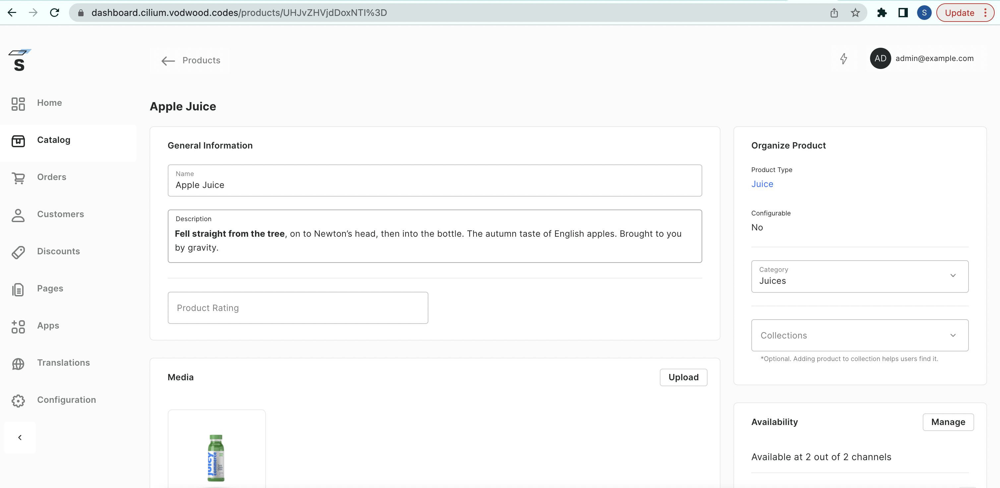

## Introduction

In this post, we will build on the knowledge we obtained in [Part 2](https://svodwood.github.io/devops-pastebin/eks-part-two-cilium-karpenter-flux/) of the EKS series and explore the practical application of Cilium security and observability controls. We will create a functional web store with the help of [Saleor](https://saleor.io/), a relatively young cloud and container-friendly open-source e-commerce platform. We will utilize several managed AWS services to help us: S3 for our static assets hosting, Amazon RDS for PostgreSQL to store our stateful data, Amazon Elasticache for Redis as a caching layer and EKS with Karpenter. As usual, Flux, the GitOps engine, will drive the cluster workload provisioning. During the demo, we will emphasize several best-practise security controls we implemented across our infrastructure. Who doesn't want a secure web store, right?

Pulumi IaC will help us bring up our infrastructure on the AWS Cloud. Check out pulumi.com if you still need to become familiar with it. You can deploy this demo stack using the Pulumi button below.

[](https://app.pulumi.com/new?template=https://github.com/svodwood/pulumi-eks-cilium-demo-webstore)

You may find the source code for this demo in [this Github repo](https://github.com/svodwood/pulumi-eks-cilium-demo-webstore). A sample Flux configuration repository for this project [is here](https://github.com/svodwood/eks-3-flux-config-repo).

## What We Are Going To Build

We aim to build a secure and highly available web store driven by Saleor on Kubernetes, running on EKS. Cilium network policy CRDs, Kubernetes ingresses and services will allow us to control the WAN traffic and server-to-server communications between various elements in the ecosystem. According to Saleor's [documentation](https://docs.saleor.io/docs/3.x/category/overview), we should have the following components up and running:
1. [Saleor Core](https://github.com/saleor/saleor) - the store's backend.
2. [Saleor Dashboard](https://github.com/saleor/saleor-dashboard) - the store administration presentation layer.
3. [Saleor Storefront](https://github.com/saleor/react-storefront) - the actual web store presentation layer.
4. [Redis](https://redis.io/docs/) cache that Saleor Core uses.
5. [PostgreSQL](https://www.postgresql.org/docs/) database that Saleor Core uses to store state.

Much like the previous post, we will spin up our best-practice VPC (this time adding some database subnets) and a demo EKS cluster, initialized with Cilium CNI, Karpenter and Flux controller. Additionally, we will create several S3 buckets, a PostgreSQL database and a Redis cluster over Elasticache.

## Flux Configuration Repository Set-up

Before launching our Pulumi template, we must set up a Flux repository. This repository will hold all definitions of things running inside our EKS cluster on the applicative level. The demo template assumes we are using a personal public repo on GitHub. Because we will not be using EKS Fargate for this demo again, Flux will bootstrap itself as expected without any intervention.

## Pulumi Stack: Basic Infrastructure, Redis, PostgreSQL, S3

To understand the flow of our infrastructure-as-code stack, we should first look at our main.py:

```python
"""An AWS Python Pulumi program"""

import pulumi

import settings
import helpers
import s3
import vpc
import subnet_groups
import vpc_endpoints
import elasticache
import rds
import eks
```

Skipping self-explanatory settings and helpers, we start with creating several S3 buckets:
1. A bucket for Saleor Dashboard - a static web application for store administrators.
2. A bucket for static assets of Django (Saleor Core) - like CSS, js and the like.
3. A bucket for media files like images and videos used by the store.

>Everything we host in S3 will not be served directly from S3 or CloudFront. Instead, we will use Nginx [proxy pods](https://github.com/nginxinc/nginx-s3-gateway) to bring the application delivery layer into the Kubernetes cluster. This way, we have fine-grained control using ingress resources and can utilize Cilium's functionality. Operating such a set-up in production would likely require fine-tuning due to the nature of the Nginx proxy and the way it authenticates against AWS sts API. Specifically, there would be a trade-off between the cache duration and the number of calls we make to AWS API.

```python
"""
s3.py
"""

from pulumi_aws import s3
from pulumi import export, ResourceOptions

from settings import general_tags, saleor_storefront_bucket_name, saleor_dashboard_bucket_name, saleor_media_bucket_name, saleor_static_bucket_name

"""
Create three S3 buckets: admin dashboard static frontend, media bucket and static assets bucket
"""

# Create the saleor dashboard bucket:
saleor_dashboard_bucket = s3.Bucket("saleor-dashboard-bucket",
    bucket=saleor_dashboard_bucket_name,
    force_destroy=True,
    tags=general_tags
)

# Disable ACL's for saleor dashboard bucket:
saleor_dashboard_bucket_ownership_controls = s3.BucketOwnershipControls("saleor-dashboard-bucket-acl",
    bucket=saleor_dashboard_bucket.id,
    rule=s3.BucketOwnershipControlsRuleArgs(
        object_ownership="BucketOwnerEnforced",
    ))

# Create the saleor media bucket:
saleor_media_bucket = s3.Bucket("saleor-media-bucket",
    bucket=saleor_media_bucket_name,
    force_destroy=True,
    tags=general_tags
)

# Disable ACL's for saleor media bucket:
saleor_media_bucket_ownership_controls = s3.BucketOwnershipControls("saleor-media-bucket-acl",
    bucket=saleor_media_bucket.id,
    rule=s3.BucketOwnershipControlsRuleArgs(
        object_ownership="BucketOwnerEnforced",
    ))

# Create the saleor static assets bucket:
saleor_static_bucket = s3.Bucket("saleor-static-bucket",
    bucket=saleor_static_bucket_name,
    force_destroy=True,
    tags=general_tags
)
# Disable ACL's for saleor static bucket:
saleor_static_bucket_ownership_controls = s3.BucketOwnershipControls("saleor-static-bucket-acl",
    bucket=saleor_static_bucket.id,
    rule=s3.BucketOwnershipControlsRuleArgs(
        object_ownership="BucketOwnerEnforced",
    ))
```

Next, we are going to create the VPC and subnets, as usual:

```python
"""
vpc.py
"""

import pulumi
from pulumi_aws import ec2, config, get_availability_zones
from settings import general_tags, cluster_descriptor, demo_vpc_cidr, demo_private_subnet_cidrs, demo_public_subnet_cidrs, demo_eks_cp_subnet_cidrs, demo_db_subnet_cidrs

"""
Creates a minium of AWS networking objects required for the demo stack to work
"""

# Create a VPC and Internet Gateway:
demo_vpc = ec2.Vpc("demo-vpc",
    cidr_block=demo_vpc_cidr,
    enable_dns_hostnames=True,
    enable_dns_support=True,
    tags={**general_tags, "Name": f"demo-vpc-{config.region}"}
)

demo_igw = ec2.InternetGateway("demo-igw",
    vpc_id=demo_vpc.id,
    tags={**general_tags, "Name": f"demo-igw-{config.region}"},
    opts=pulumi.ResourceOptions(parent=demo_vpc)
)

# Create a default any-any security group for demo purposes:
demo_sg = ec2.SecurityGroup("demo-security-group",
    description="Allow any-any",
    vpc_id=demo_vpc.id,
    ingress=[ec2.SecurityGroupIngressArgs(
        description="Any",
        from_port=0,
        to_port=0,
        protocol="-1",
        cidr_blocks=["0.0.0.0/0"],
        ipv6_cidr_blocks=["::/0"],
    )],
    egress=[ec2.SecurityGroupEgressArgs(
        from_port=0,
        to_port=0,
        protocol="-1",
        cidr_blocks=["0.0.0.0/0"],
        ipv6_cidr_blocks=["::/0"],
    )],
    tags={**general_tags, "Name": f"demo-sg-{config.region}"},
    opts=pulumi.ResourceOptions(parent=demo_vpc)
)

# Create subnets:
demo_azs = get_availability_zones(state="available").names
demo_public_subnets = []
demo_private_subnets = []
demo_eks_cp_subnets = []
demo_db_subnets = []

for i in range(2):
    prefix = f"{demo_azs[i]}"
    
    demo_public_subnet = ec2.Subnet(f"demo-public-subnet-{prefix}",
        vpc_id=demo_vpc.id,
        cidr_block=demo_public_subnet_cidrs[i],
        availability_zone=demo_azs[i],
        tags={**general_tags, "Name": f"demo-public-subnet-{prefix}"},
        opts=pulumi.ResourceOptions(parent=demo_vpc)
    )
    
    demo_public_subnets.append(demo_public_subnet)

    demo_public_route_table = ec2.RouteTable(f"demo-public-rt-{prefix}",
        vpc_id=demo_vpc.id,
        tags={**general_tags, "Name": f"demo-public-rt-{prefix}"},
        opts=pulumi.ResourceOptions(parent=demo_public_subnet)
    )
    
    demo_public_route_table_association = ec2.RouteTableAssociation(f"demo-public-rt-association-{prefix}",
        route_table_id=demo_public_route_table.id,
        subnet_id=demo_public_subnet.id,
        opts=pulumi.ResourceOptions(parent=demo_public_subnet)
    )

    demo_public_wan_route = ec2.Route(f"demo-public-wan-route-{prefix}",
        route_table_id=demo_public_route_table.id,
        gateway_id=demo_igw.id,
        destination_cidr_block="0.0.0.0/0",
        opts=pulumi.ResourceOptions(parent=demo_public_subnet)
    )

    demo_eip = ec2.Eip(f"demo-eip-{prefix}",
        tags={**general_tags, "Name": f"demo-eip-{prefix}"},
        opts=pulumi.ResourceOptions(parent=demo_vpc)
    )
    
    demo_nat_gateway = ec2.NatGateway(f"demo-nat-gateway-{prefix}",
        allocation_id=demo_eip.id,
        subnet_id=demo_public_subnet.id,
        tags={**general_tags, "Name": f"demo-nat-{prefix}"},
        opts=pulumi.ResourceOptions(depends_on=[demo_vpc])
    )

    demo_private_subnet = ec2.Subnet(f"demo-private-subnet-{prefix}",
        vpc_id=demo_vpc.id,
        cidr_block=demo_private_subnet_cidrs[i],
        availability_zone=demo_azs[i],
        tags={**general_tags, "cilium-pod-interfaces": "private" ,"Name": f"demo-private-subnet-{prefix}", "karpenter.sh/discovery": f"{cluster_descriptor}"},
        opts=pulumi.ResourceOptions(parent=demo_vpc)
    )
    
    demo_private_subnets.append(demo_private_subnet)

    demo_private_route_table = ec2.RouteTable(f"demo-private-rt-{prefix}",
        vpc_id=demo_vpc.id,
        tags={**general_tags, "Name": f"demo-private-rt-{prefix}"},
        opts=pulumi.ResourceOptions(parent=demo_private_subnet)
    )
    
    demo_private_route_table_association = ec2.RouteTableAssociation(f"demo-private-rt-association-{prefix}",
        route_table_id=demo_private_route_table.id,
        subnet_id=demo_private_subnet.id,
        opts=pulumi.ResourceOptions(parent=demo_private_subnet)
    )

    demo_private_wan_route = ec2.Route(f"demo-private-wan-route-{prefix}",
        route_table_id=demo_private_route_table.id,
        nat_gateway_id=demo_nat_gateway.id,
        destination_cidr_block="0.0.0.0/0",
        opts=pulumi.ResourceOptions(parent=demo_private_subnet)
    )

    demo_eks_cp_subnet = ec2.Subnet(f"demo-eks-cp-subnet-{prefix}",
        vpc_id=demo_vpc.id,
        cidr_block=demo_eks_cp_subnet_cidrs[i],
        availability_zone=demo_azs[i],
        tags={**general_tags, "Name": f"demo-eks-cp-subnet-{prefix}"},
        opts=pulumi.ResourceOptions(parent=demo_vpc)
    )
    
    demo_eks_cp_subnets.append(demo_eks_cp_subnet)

    demo_eks_cp_route_table = ec2.RouteTable(f"demo-eks-cp-rt-{prefix}",
        vpc_id=demo_vpc.id,
        tags={**general_tags, "Name": f"demo-eks-cp-rt-{prefix}"},
        opts=pulumi.ResourceOptions(parent=demo_eks_cp_subnet)
    )
    
    demo__eks_cp_route_table_association = ec2.RouteTableAssociation(f"demo-eks-cp-rt-association-{prefix}",
        route_table_id=demo_eks_cp_route_table.id,
        subnet_id=demo_eks_cp_subnet.id,
        opts=pulumi.ResourceOptions(parent=demo_eks_cp_subnet)
    )

    demo_eks_cp_wan_route = ec2.Route(f"demo-eks-cp-wan-route-{prefix}",
        route_table_id=demo_eks_cp_route_table.id,
        nat_gateway_id=demo_nat_gateway.id,
        destination_cidr_block="0.0.0.0/0",
        opts=pulumi.ResourceOptions(parent=demo_eks_cp_subnet)
    )

    demo_db_subnet = ec2.Subnet(f"demo-db-subnet-{prefix}",
        vpc_id=demo_vpc.id,
        cidr_block=demo_db_subnet_cidrs[i],
        availability_zone=demo_azs[i],
        tags={**general_tags, "Name": f"demo-db-subnet-{prefix}"},
        opts=pulumi.ResourceOptions(parent=demo_vpc)
    )
    
    demo_db_subnets.append(demo_db_subnet)

    demo_db_route_table = ec2.RouteTable(f"demo-db-rt-{prefix}",
        vpc_id=demo_vpc.id,
        tags={**general_tags, "Name": f"demo-db-rt-{prefix}"},
        opts=pulumi.ResourceOptions(parent=demo_db_subnet)
    )
    
    demo__db_route_table_association = ec2.RouteTableAssociation(f"demo-db-rt-association-{prefix}",
        route_table_id=demo_eks_cp_route_table.id,
        subnet_id=demo_db_subnet.id,
        opts=pulumi.ResourceOptions(parent=demo_db_subnet)
    )

    demo_db_wan_route = ec2.Route(f"demo-db-wan-route-{prefix}",
        route_table_id=demo_db_route_table.id,
        nat_gateway_id=demo_nat_gateway.id,
        destination_cidr_block="0.0.0.0/0",
        opts=pulumi.ResourceOptions(parent=demo_db_subnet)
    )
```
Notice above how we added some dedicated subnets for our PostgreSQL database. In addition, our VPC contains a pair of public subnets for our load balancer interfaces, private subnets for our Kubernetes nodes and dedicated private subnets for the EKS control plane network interfaces.

Next, let's handle the subnet groups for our Elasticache and RDS resources. Subnet groups are a collection of subnets we dedicate to specific clusters, SQL or NoSQL.

```python
"""
subnet_groups.py
"""

from pulumi_aws import rds, elasticache

from settings import general_tags
from vpc import demo_vpc, demo_db_subnets

demo_postgresql_subnet_group = rds.SubnetGroup("demo-postgresql-subnet-group",
    subnet_ids=[s.id for s in demo_db_subnets],
    description="Saleor PostgreSQL Subnet Group",
    tags={**general_tags, "Name": f"demo-postgresql-subnet-group"}
)

demo_redis_subnet_group = elasticache.SubnetGroup("demo-redis-subnet-group",
    subnet_ids=[s.id for s in demo_db_subnets],
    description="Saleor Redis Subnet Group",
    tags={**general_tags, "Name": f"demo-redis-subnet-group"}
)
```

To establish private communication between AWS services and our EKS cluster, we need to build several VPC Interface endpoints. We will use a shared security group with port 443 open from our VPC CIDR range for simplicity. Here is the list of endpoints:
- ecr.api
- ecr.dkr
- ec2
- sts
- logs
- s3
- email-smtp
- cloudformation

Below is the code:

```python
"""
vpc_endpoints.py
"""

from pulumi_aws import ec2
from pulumi import ResourceOptions
from settings import deployment_region, endpoint_services, general_tags, demo_vpc_cidr
from vpc import demo_vpc, demo_private_subnets


# Create a shared security group for all AWS services VPC endpoints:
vpc_endpoints_sg = ec2.SecurityGroup("aws-vpc-endpoints-sg",
    description="Shared security groups for AWS services VPC endpoints",
    vpc_id=demo_vpc.id,
    tags={**general_tags, "Name": "aws-vpc-endpoints-sg"}
)

inbound_endpoints_cidrs = ec2.SecurityGroupRule("inbound-vpc-endpoint-cidrs",
    type="ingress",
    from_port=443,
    to_port=443,
    protocol="tcp",
    cidr_blocks=[demo_vpc_cidr],
    security_group_id=vpc_endpoints_sg.id
)

outbound_endpoints_cidrs = ec2.SecurityGroupRule("outbound-vpc-endpoint-cidrs",
    type="egress",
    to_port=0,
    protocol="-1",
    from_port=0,
    cidr_blocks=["0.0.0.0/0"],
    security_group_id=vpc_endpoints_sg.id
)

# Create VPC endpoints:
endpoints = []
for service in endpoint_services:
    if service == "s3":
        enable_dns = False
    else:
        enable_dns = True
    endpoints.append(ec2.VpcEndpoint(f"{service.replace('.','-')}-vpc-endpoint",
        vpc_id = demo_vpc.id,
        service_name = f"com.amazonaws.{deployment_region}.{service}",
        vpc_endpoint_type = "Interface",
        subnet_ids = [s.id for s in demo_private_subnets],
        security_group_ids = [vpc_endpoints_sg.id],
        private_dns_enabled = enable_dns,
        tags = {**general_tags, "Name": f"{service.replace('.','-')}-vpc-endpoint"},
        opts = ResourceOptions(
            depends_on=[vpc_endpoints_sg],
            parent=demo_vpc)
        ))
```

Next, we provision an Elasticache Redis cluster for our Saleor core pods. Finally, we allow connection over port 6379 from our private Kubernetes node subnets. We will utilize AWS SSM Parameter Store to store the entire Redis connection string that our Saleor core application will consume later. 

```python
"""
elasticache.py
"""

from pulumi_aws import elasticache, cloudwatch, ec2, ssm
from pulumi import export, Output

from settings import general_tags, redis_instance_size, demo_private_subnet_cidrs, redis_connection_string_ssm_parameter_name
from subnet_groups import demo_redis_subnet_group
from vpc import demo_vpc

"""
Create the Redis Cloudwatch log group:
"""
demo_redis_loggroup = cloudwatch.LogGroup("demo-redis-loggroup", 
    name=f"/aws/elasticache/redis",
    tags=general_tags,
    retention_in_days=1
)

"""
Create a Redis cluster security group:
"""
demo_redis_security_group = ec2.SecurityGroup(f"demo-redis-security-group",
    description="Redis security group",
    vpc_id=demo_vpc.id,
    tags={**general_tags, "Name": "demo-redis-security-group"}
)

# Allow tcp Redis traffic from application subnets:
demo_redis_security_group_inbound = ec2.SecurityGroupRule("demo-redis-security-group-inbound",
    type="ingress",
    from_port=6379,
    to_port=6379,
    protocol="tcp",
    cidr_blocks=demo_private_subnet_cidrs,
    security_group_id=demo_redis_security_group.id
)

# Allow outbound ANY:
demo_redis_security_group_oubound = ec2.SecurityGroupRule("demo-redis-security-group-outbound",
    type="egress",
    to_port=0,
    protocol="-1",
    from_port=0,
    cidr_blocks=["0.0.0.0/0"],
    security_group_id=demo_redis_security_group.id
)

"""
Create a Redis cluster:
"""
demo_redis_cluster = elasticache.ReplicationGroup("demo-saleor-core-redis-cluster",
    automatic_failover_enabled=True,
    description="Saleor Core Cache",
    node_type=redis_instance_size,
    multi_az_enabled=True,
    parameter_group_name="default.redis7",
    port=6379,
    num_cache_clusters=2,
    subnet_group_name=demo_redis_subnet_group,
    security_group_ids=[demo_redis_security_group.id],
    log_delivery_configurations=[
        elasticache.ReplicationGroupLogDeliveryConfigurationArgs(
            destination=demo_redis_loggroup,
            destination_type="cloudwatch-logs",
            log_format="text",
            log_type="slow-log",
        )
    ],
    tags={**general_tags, "Name": "demo-saleor-core-redis-cluster"}
)
export("redis-primary-endpoint", demo_redis_cluster.primary_endpoint_address)
export("redis-reader-endpoint", demo_redis_cluster.reader_endpoint_address)

redis_endpoint = Output.concat("redis://", demo_redis_cluster.primary_endpoint_address, ":6379")

"""
Populate SSM parameter store with the Redis connection string:
"""
demo_redis_cluster_connection_string = ssm.Parameter("saleor-redis-connection-string",
    name=redis_connection_string_ssm_parameter_name,
    description="Redis connection string for Saleor Core in CACHE_URL format",
    type="SecureString",
    value=redis_endpoint,
    tags={**general_tags, "Name": "saleor-redis-cluster-connection-string"}
)
```

We will provide a simple PostgreSQL multi-az cluster for our database tier with one primary and one stand-by node. For the sake of the exercise, we will not cover all the intricacies of database provisioning and administration on RDS. We will create a security group that allows access from private subnets over port 5432. Like we did with Redis, we will utilize AWS SSM Parameter Store to store the entire PostgreSQL connection string that our Saleor core application will consume later:

```python
"""
rds.py
"""

from pulumi_aws import rds, ec2, ssm
from pulumi import export, ResourceOptions, Output

from settings import general_tags, postgres_instance_size, demo_db_subnet_cidrs, demo_private_subnet_cidrs, sql_user, sql_password, db_name, sql_connection_string_ssm_parameter_name
from subnet_groups import demo_postgresql_subnet_group
from vpc import demo_vpc

"""
Create a PostgreSQL cluster security group:
"""
demo_sql_security_group = ec2.SecurityGroup(f"demo-sql-security-group",
    description="PostgreSQL security group",
    vpc_id=demo_vpc.id,
    tags={**general_tags, "Name": "demo-sql-security-group"}
)

# Allow tcp Redis traffic from application subnets:
demo_sql_security_group_inbound = ec2.SecurityGroupRule("demo-sql-security-group-inbound",
    type="ingress",
    from_port=5432,
    to_port=5432,
    protocol="tcp",
    cidr_blocks=demo_private_subnet_cidrs,
    security_group_id=demo_sql_security_group.id
)

# Allow outbound ANY:
demo_sql_security_group_oubound = ec2.SecurityGroupRule("demo-sql-security-group-outbound",
    type="egress",
    to_port=0,
    protocol="-1",
    from_port=0,
    cidr_blocks=["0.0.0.0/0"],
    security_group_id=demo_sql_security_group.id
)
"""
Create a PostgreSQL cluster:
"""
demo_sql_cluster = rds.Instance("demo-saleor-core-sql-cluster",
    db_subnet_group_name=demo_postgresql_subnet_group.name,
    vpc_security_group_ids=[demo_sql_security_group.id],
    storage_encrypted=True,
    allocated_storage=20,
    storage_type="gp3",
    identifier="saleor",
    multi_az=True,
    engine="postgres",
    engine_version="13.7",
    port=5432,
    performance_insights_enabled=False,
    network_type="IPV4",
    instance_class=postgres_instance_size,
    skip_final_snapshot=True,
    iam_database_authentication_enabled=False,
    auto_minor_version_upgrade=False,
    apply_immediately=True,
    username=sql_user,
    password=sql_password,
    db_name=db_name,
    tags={**general_tags, "Name": "demo-saleor-core-sql-cluster"},
    opts=ResourceOptions(delete_before_replace=True)
)

export("postgres-endpoint", demo_sql_cluster.endpoint)
postgres_endpoint = Output.concat("postgres://", sql_user, ":", sql_password, "@", demo_sql_cluster.endpoint, "/", db_name)

"""
Populate SSM parameter store with the SQL connection string:
"""
demo_sql_cluster_connection_string = ssm.Parameter("saleor-sql-connection-string",
    name=sql_connection_string_ssm_parameter_name,
    description="PostgreSQL connection string for Saleor Core in DATABASE_URL format",
    type="SecureString",
    value=postgres_endpoint,
    tags={**general_tags, "Name": "saleor-sql-cluster-connection-string"}
)
```

Finally, we reached the exciting part - the EKS cluster:

```python
"""
eks.py
"""

from pulumi_aws import iam, ec2, eks, config, cloudwatch
import pulumi_eks as eks_provider
from pulumi import export, ResourceOptions, Output
import pulumi_kubernetes as k8s
from pulumi_kubernetes.helm.v3 import Release, ReleaseArgs, RepositoryOptsArgs

import json

from settings import general_tags, cluster_descriptor, flux_github_repo_owner, flux_github_repo_name, flux_github_token, flux_cli_version, cilium_release_version, saleor_storefront_bucket_name, saleor_dashboard_bucket_name, saleor_media_bucket_name, saleor_static_bucket_name, sql_connection_string_ssm_parameter_name, redis_connection_string_ssm_parameter_name, deployment_region, account_id
from vpc import demo_vpc, demo_private_subnets, demo_eks_cp_subnets
from helpers import create_iam_role, create_oidc_role, create_policy

"""
Shared EKS resources: IAM policies for EKS, Karpenter and Cilium
"""

# Create an EKS cluster role:
eks_iam_role_policy_arns = [
    "arn:aws:iam::aws:policy/AmazonEKSClusterPolicy",
    "arn:aws:iam::aws:policy/AmazonEKSVPCResourceController"
]

eks_iam_role = create_iam_role(f"{cluster_descriptor}-eks-role", "Service", "eks.amazonaws.com", eks_iam_role_policy_arns)

# Create a default node role for Karpenter:
karpenter_default_nodegroup_role_policy_arns = [
    "arn:aws:iam::aws:policy/AmazonEKSWorkerNodePolicy",
    "arn:aws:iam::aws:policy/AmazonEC2ContainerRegistryReadOnly",
    "arn:aws:iam::aws:policy/AmazonSSMManagedInstanceCore",
    "arn:aws:iam::aws:policy/AmazonEKS_CNI_Policy"
]

# Cilium CNI service account policies:
cni_service_account_policy_arns = [
    "arn:aws:iam::aws:policy/AmazonEKS_CNI_Policy",
    "arn:aws:iam::aws:policy/AmazonEKSWorkerNodePolicy"
]

"""
A set of custom security groups: one for the EKS cluster and one for the Karpenter-managed nodes.
"""
# Both security groups created below. These security groups are attached to the EKS control plane interface endpoints as well as the nodes,
# provisioned by Karpenter.
"""
Node security group:
"""
# Create a custom default demo EKS cluster nodegroup security group:
demo_nodegroup_security_group = ec2.SecurityGroup(f"custom-node-attach-{cluster_descriptor}",
    description=f"{cluster_descriptor} custom node security group",
    vpc_id=demo_vpc.id,
    tags={**general_tags, "Name": f"custom-node-attach-{cluster_descriptor}", "karpenter.sh/discovery": f"{cluster_descriptor}"}
)

# Allow all node instances to communicate with each other:
demo_nodegroup_security_group_inbound_self = ec2.SecurityGroupRule(f"inbound-eks-node-self-{cluster_descriptor}",
    type="ingress",
    from_port=0,
    to_port=0,
    protocol="-1",
    self=True,
    security_group_id=demo_nodegroup_security_group.id
)

# Allow outbound ANY:
demo_nodegroup_security_group_oubound_custom_cidrs = ec2.SecurityGroupRule(f"outbound-eks-node-{cluster_descriptor}",
    type="egress",
    to_port=0,
    protocol="-1",
    from_port=0,
    cidr_blocks=["0.0.0.0/0"],
    security_group_id=demo_nodegroup_security_group.id
)

"""
Cluster security group:
"""
# Create a default demo EKS cluster security group:
demo_cluster_security_group = ec2.SecurityGroup(f"custom-cluster-attach-{cluster_descriptor}",
    description=f"{cluster_descriptor} custom security group",
    vpc_id=demo_vpc.id,
    tags={**general_tags, "Name": f"custom-cluster-attach-{cluster_descriptor}"}
)

# Allow all traffic from custom Karpenter node security group:
demo_cluster_security_group_inbound_node = ec2.SecurityGroupRule(f"inbound-eks-cp-inbound-node-{cluster_descriptor}",
    type="ingress",
    from_port=0,
    to_port=0,
    protocol="-1",
    source_security_group_id=demo_nodegroup_security_group,
    security_group_id=demo_cluster_security_group.id
)

# Allow kubectl from ANY:
demo_cluster_security_group_inbound_443 = ec2.SecurityGroupRule(f"inbound-eks-cp-443-{cluster_descriptor}",
    type="ingress",
    from_port=443,
    to_port=443,
    protocol="-1",
    cidr_blocks=["0.0.0.0/0"],
    security_group_id=demo_cluster_security_group.id
)

# Allow outbound ANY:
demo_cluster_security_group_oubound_custom_cidrs = ec2.SecurityGroupRule(f"outbound-eks-cp-{cluster_descriptor}",
    type="egress",
    to_port=0,
    protocol="-1",
    from_port=0,
    cidr_blocks=["0.0.0.0/0"],
    security_group_id=demo_cluster_security_group.id
)

# Allow all traffic from cluster SG to nodes after the cluster SG is defined:
demo_nodegroup_security_group_inbound_from_cp = ec2.SecurityGroupRule(f"inbound-eks-node-from-cp-{cluster_descriptor}",
    type="ingress",
    from_port=0,
    to_port=0,
    protocol="-1",
    source_security_group_id=demo_cluster_security_group,
    security_group_id=demo_nodegroup_security_group.id
)

"""
Instance profile for Karpenter-managed nodes:
"""

# Create a default Karpenter node role and instance profile:
karpenter_node_role = create_iam_role(f"KarpenterNodeRole-{cluster_descriptor}", "Service", "ec2.amazonaws.com", karpenter_default_nodegroup_role_policy_arns)
karpenter_instance_profile = iam.InstanceProfile(f"KarpenterNodeInstanceProfile-{cluster_descriptor}",
    role=karpenter_node_role.name,
    name=f"KarpenterNodeInstanceProfile-{cluster_descriptor}"
)

"""
EKS Control Plane
"""

# Create an EKS log group:
demo_eks_loggroup = cloudwatch.LogGroup("demo-eks-loggroup", 
    name=f"/aws/eks/{cluster_descriptor}/cluster",
    tags=general_tags,
    retention_in_days=1
)

# Create the cluster control plane:
demo_eks_cluster = eks_provider.Cluster(f"eks-{cluster_descriptor}",
    name=f"{cluster_descriptor}",
    vpc_id=demo_vpc.id,
    instance_role=karpenter_node_role,
    cluster_security_group=demo_cluster_security_group,
    create_oidc_provider=True,
    version="1.24",
    instance_profile_name=karpenter_instance_profile,
    skip_default_node_group=True,
    service_role=eks_iam_role,
    provider_credential_opts=eks_provider.KubeconfigOptionsArgs(
        profile_name=config.profile,
    ),
    endpoint_private_access=True,
    endpoint_public_access=True,
    enabled_cluster_log_types=["api", "audit", "authenticator", "controllerManager", "scheduler"],
    public_access_cidrs=["0.0.0.0/0"],
    subnet_ids=[s.id for s in demo_eks_cp_subnets],
    default_addons_to_remove=["coredns", "kube-proxy", "vpc-cni"],
    tags={**general_tags, "Name": f"{cluster_descriptor}"},
    fargate=False,
    opts=ResourceOptions(depends_on=[
            demo_nodegroup_security_group,
            eks_iam_role,
            demo_eks_loggroup
        ]))

demo_eks_cluster_oidc_arn = demo_eks_cluster.core.oidc_provider.arn
demo_eks_cluster_oidc_url = demo_eks_cluster.core.oidc_provider.url

"""
Cilium service account, Karpenter service account:
"""

# Create an IAM role for Cilium CNI:
iam_role_vpc_cni_service_account_role = create_oidc_role(f"{cluster_descriptor}-cilium", "kube-system", demo_eks_cluster_oidc_arn, demo_eks_cluster_oidc_url, "cilium-operator", cni_service_account_policy_arns)
export("cilium-oidc-role-arn", iam_role_vpc_cni_service_account_role.arn)

# Create a Karpenter IAM role scoped to karpenter namespace:
iam_role_karpenter_controller_policy = create_policy(f"{cluster_descriptor}-karpenter-policy", "karpenter_oidc_role_policy.json")
iam_role_karpenter_controller_service_account_role = create_oidc_role(f"{cluster_descriptor}-karpenter", "karpenter", demo_eks_cluster_oidc_arn, demo_eks_cluster_oidc_url, "karpenter", [iam_role_karpenter_controller_policy.arn])
export("karpenter-oidc-role-arn", iam_role_karpenter_controller_service_account_role.arn)

"""
Kubernetes Pulumi provider to create objects inside the cluster:
"""

# Create a kubernetes provider:
role_provider = k8s.Provider(f"{cluster_descriptor}-kubernetes-provider",
    kubeconfig=demo_eks_cluster.kubeconfig,
    enable_server_side_apply=True,
    opts=ResourceOptions(depends_on=[demo_eks_cluster])
)

# Patch the aws-node DaemonSet to make sure it's unshedulable to any node in the cluster, using server side apply:
patch_aws_node = k8s.apps.v1.DaemonSetPatch("aws-node-patch",
    metadata=k8s.meta.v1.ObjectMetaPatchArgs(
        annotations={
            "pulumi.com/patchForce": "true",
        },
        name="aws-node",
        namespace="kube-system"
    ),
    spec=k8s.apps.v1.DaemonSetSpecPatchArgs(
        template=k8s.core.v1.PodTemplateSpecPatchArgs(
            spec=k8s.core.v1.PodSpecPatchArgs(
                affinity=k8s.core.v1.AffinityPatchArgs(
                    node_affinity=k8s.core.v1.NodeAffinityPatchArgs(
                        required_during_scheduling_ignored_during_execution=k8s.core.v1.NodeSelectorPatchArgs(
                            node_selector_terms=[k8s.core.v1.NodeSelectorTermPatchArgs(
                                match_expressions=[k8s.core.v1.NodeSelectorRequirementPatchArgs(
                                    key="kubernetes.io/os",
                                    operator="In",
                                    values=["no-schedule"]
                                )]
                            )]
                        )
                    )
                )
            )
        )
    ),
    opts=ResourceOptions(
        provider=role_provider,
        depends_on=[demo_eks_cluster]
    )
)

cluster_endpoint_fqdn = demo_eks_cluster.core.endpoint

"""
Create a managed node group and install Cilium via helm in parallel. A managed nodegroup will fail to reach a "Ready" state 
without the CNI daemon running and the helm chart will fail to install if no nodes are available. Let the race begin!
"""

# Create a cilium Helm release when the control plane is initialized:
cilium_cni_release = Release("cilium-cni",
    ReleaseArgs(
        chart="cilium",
        version=cilium_release_version,
        namespace="kube-system",
        repository_opts=RepositoryOptsArgs(
            repo="https://helm.cilium.io",
        ),
        values=Output.all(iam_role_vpc_cni_service_account_role.arn, cluster_endpoint_fqdn).apply(
            lambda args:
                {
                "ingressController": {
                    "enabled": True,
                },
                "eni": {
                    "enabled": True,
                    "iamRole": args[0],
                    "updateEC2AdapterLimitViaAPI": True,
                    "awsReleaseExcessIPs": True,
                    "subnetTagsFilter": "cilium-pod-interfaces=private",
                },
                "ipam": {
                    "mode": "eni",
                },
                "egressMasqueradeInterfaces": "eth0",
                "tunnel": "disabled",
                "loadBalancer": {
                    "algorithm": "maglev",
                },
                "kubeProxyReplacement": "strict",
                "k8sServiceHost": args[1].replace("https://",""),
                "hubble": {
                    "relay": {
                        "enabled": True,
                    },
                    "ui": {
                        "enabled": True
                    }
                }
            }
        )
    ),
    opts=ResourceOptions(
        provider=role_provider,
        depends_on=[demo_eks_cluster, patch_aws_node]
    )
)

# Create an initial Nodegroup when the control plane is initialized:
managed_nodegroup = eks_provider.ManagedNodeGroup("cilium-managed-nodegroup",
    cluster=demo_eks_cluster,
    node_group_name="managed-nodegroup",
    node_role=karpenter_node_role,
    subnet_ids=[s.id for s in demo_private_subnets],
    force_update_version=True,
    ami_type="BOTTLEROCKET_ARM_64",
    instance_types=["t4g.medium"],
    scaling_config={
        "desired_size": 2,
        "min_size": 2,
        "max_size": 2
    },
    capacity_type="ON_DEMAND",
    tags={**general_tags, "Name": f"cilium-managed-nodegroup"},
    taints=[
        {
            "key": "node.cilium.io/agent-not-ready",
            "value": "true",
            "effect": "NO_EXECUTE"
        }
    ],
    opts=ResourceOptions(
        depends_on=[demo_eks_cluster, patch_aws_node]
    )
)

"""
Default EKS core-dns add-on:
"""

# Install CoreDNS addon when the cluster is initialized:
core_dns_addon = eks.Addon("coredns-addon",
    cluster_name=f"{cluster_descriptor}",
    addon_name="coredns",
    addon_version="v1.8.7-eksbuild.3",
    resolve_conflicts="OVERWRITE",
    opts=ResourceOptions(
        depends_on=[managed_nodegroup, cilium_cni_release]
    )
)

"""
Flux controller set-up:
"""

# Create a service account and cluster role binding for flux controller
flux_service_account = k8s.core.v1.ServiceAccount("flux-controller-service-account",
    api_version="v1",
    kind="ServiceAccount",
    metadata=k8s.meta.v1.ObjectMetaArgs(
        name="flux-controller",
        namespace="kube-system"
    ),
    opts=ResourceOptions(
        provider=role_provider,
        depends_on=[demo_eks_cluster]
    )
)

flux_controller_cluster_role_binding = k8s.rbac.v1.ClusterRoleBinding("flux-controller-sa-crb",
    role_ref=k8s.rbac.v1.RoleRefArgs(
        api_group="rbac.authorization.k8s.io",
        kind="ClusterRole",
        name="cluster-admin"
    ),
    subjects=[
        k8s.rbac.v1.SubjectArgs(
            kind="ServiceAccount",
            name="flux-controller",
            namespace="kube-system"
        )
    ],
    opts=ResourceOptions(
        provider=role_provider,
        depends_on=[demo_eks_cluster]
    )
)

# Create the bootstrap job for flux-cli
flux_bootstrap_job = k8s.batch.v1.Job("fluxBootstrapJob",
    opts=ResourceOptions(
        provider=role_provider,
        depends_on=[flux_service_account, flux_controller_cluster_role_binding, core_dns_addon]
    ),
    metadata=k8s.meta.v1.ObjectMetaArgs(
        name="flux-bootstrap-job",
        namespace="kube-system",
        annotations={"pulumi.com/replaceUnready": "true"}
    ),
    spec=k8s.batch.v1.JobSpecArgs(
        backoff_limit=3,
        template=k8s.core.v1.PodTemplateSpecArgs(
            spec=k8s.core.v1.PodSpecArgs(
                service_account_name="flux-controller",
                containers=[k8s.core.v1.ContainerArgs(
                    env=[k8s.core.v1.outputs.EnvVar(
                        name="GITHUB_TOKEN",
                        value=flux_github_token
                    )],
                    command=[
                        "flux",
                        "bootstrap",
                        "github",
                        f"--owner={flux_github_repo_owner}",
                        f"--repository={flux_github_repo_name}",
                        f"--path=./clusters/{cluster_descriptor}",
                        "--private=false",
                        "--personal=true"
                    ],
                    image=f"fluxcd/flux-cli:v{flux_cli_version}",
                    name="flux-bootstrap",
                )],
                restart_policy="OnFailure",
            ),
        ),
    ))

"""
Karpenter namespace to deploy Karpenter controller into:
"""

# Create a karpenter namespace:
karpenter_namespace = k8s.core.v1.Namespace("karpenter-namespace",
    metadata={"name": "karpenter"},
    opts=ResourceOptions(
        provider=role_provider,
        depends_on=[demo_eks_cluster]
    )
)

"""
Set up a service account role for cert-manager, should you need one with this stack
"""
# cert-manager Service Account in kube-system
iam_role_cert_manager_policy = create_policy(f"{cluster_descriptor}-cert-manager-policy", "certmanager_oidc_role_policy.json")
iam_role_cert_manager_service_account_role = create_oidc_role("cert-manager-sa", "kube-system", demo_eks_cluster_oidc_arn, demo_eks_cluster_oidc_url, "cert-manager-sa", [iam_role_cert_manager_policy.arn])
export("cert-manager-oidc-role-arn", iam_role_cert_manager_service_account_role.arn)

"""
Set up a service account role for external-dns, should you need one with this stack
"""
# External DNS Service Account in kube-system
iam_role_external_dns_controller_policy = create_policy(f"{cluster_descriptor}-external-dns-policy", "external_dns_controller_oidc_role_policy.json")
iam_role_external_dns_controller_service_account_role = create_oidc_role("external-dns-controller-sa", "kube-system", demo_eks_cluster_oidc_arn, demo_eks_cluster_oidc_url, "external-dns-controller-sa", [iam_role_external_dns_controller_policy.arn])
export("external-dns-controller-oidc-role-arn", iam_role_external_dns_controller_service_account_role.arn)


"""
Set up namespace and service account for External Secrets operator
"""
external_secrets_core_namespace = k8s.core.v1.Namespace("external-secrets-namespace",
    metadata={"name": "external-secrets"},
    opts=ResourceOptions(
        provider=role_provider,
        depends_on=[demo_eks_cluster]
    )
)

# Add service account role for External Secrets SA to fetch RDS secret from Parameter Store:
external_secrets_service_account_policy = iam.Policy("external-secrets-sa-policy",
    description="External Secrets Service Account SSM Parameter Store Policy",
    policy=json.dumps({
        "Version": "2012-10-17",
        "Statement": [{
            "Action": [
                "ssm:GetParameter",
                "ssm:GetParametersByPath",
                "ssm:GetParameters"
            ],
            "Effect": "Allow",
            "Resource": [
                f"arn:aws:ssm:{deployment_region}:{account_id}:parameter/{sql_connection_string_ssm_parameter_name}",
                f"arn:aws:ssm:{deployment_region}:{account_id}:parameter/{redis_connection_string_ssm_parameter_name}"
            ]
        }],
    })
)

# External Secrets IAM role for service account:
iam_role_external_secrets_service_account_role = create_oidc_role("external-secrets-sa", "external-secrets", demo_eks_cluster_oidc_arn, demo_eks_cluster_oidc_url, "external-secrets-sa", [external_secrets_service_account_policy.arn])
export("external-secrets-oidc-role-arn", iam_role_external_secrets_service_account_role.arn)

"""
Set up namespaces and service accounts for Saleor components
"""
# Saleor Core namespace
saleor_core_namespace = k8s.core.v1.Namespace("saleor-core-namespace",
    metadata={"name": "saleor-core"},
    opts=ResourceOptions(
        provider=role_provider,
        depends_on=[demo_eks_cluster]
    )
)

# Saleor Core service account policy:
saleor_core_service_account_policy = iam.Policy("saleor-core-sa-policy",
    description="Saleor Core Service Account S3 Bucket Policy",
    policy=json.dumps({
        "Version": "2012-10-17",
        "Statement": [{
            "Action": [
                "s3:*"
            ],
            "Effect": "Allow",
            "Resource": [
                f"arn:aws:s3:::{saleor_media_bucket_name}",
                f"arn:aws:s3:::{saleor_media_bucket_name}/*",
                f"arn:aws:s3:::{saleor_static_bucket_name}",
                f"arn:aws:s3:::{saleor_static_bucket_name}/*"
            ]
        }],
    })
)

# Saleor Core IAM role for service account:
iam_role_saleor_core_service_account_role = create_oidc_role("saleor-core-sa", "saleor-core", demo_eks_cluster_oidc_arn, demo_eks_cluster_oidc_url, "saleor-core-sa", [saleor_core_service_account_policy.arn])
export("saleor-core-oidc-role-arn", iam_role_saleor_core_service_account_role.arn)

# Saleor Dashboard namespace
saleor_dashboard_namespace = k8s.core.v1.Namespace("saleor-dashboard-namespace",
    metadata={"name": "saleor-dashboard"},
    opts=ResourceOptions(
        provider=role_provider,
        depends_on=[demo_eks_cluster]
    )
)

# Saleor Dashboard service account policy:
saleor_dashboard_service_account_policy = iam.Policy("saleor-dashboard-sa-policy",
    description="Saleor Dashboard Service Account S3 Bucket Policy",
    policy=json.dumps({
        "Version": "2012-10-17",
        "Statement": [{
            "Action": [
                "s3:GetObject",
                "s3:ListBucket"
            ],
            "Effect": "Allow",
            "Resource": [
                f"arn:aws:s3:::{saleor_dashboard_bucket_name}",
                f"arn:aws:s3:::{saleor_dashboard_bucket_name}/*"
            ]
        }],
    })
)

iam_role_saleor_dashboard_service_account_role = create_oidc_role("saleor-dashboard-sa", "saleor-dashboard", demo_eks_cluster_oidc_arn, demo_eks_cluster_oidc_url, "saleor-dashboard-sa", [saleor_dashboard_service_account_policy.arn])
export("saleor-dashboard-oidc-role-arn", iam_role_saleor_dashboard_service_account_role.arn)

# Saleor Storefront namespace
saleor_storefront_namespace = k8s.core.v1.Namespace("saleor-storefront-namespace",
    metadata={"name": "saleor-storefront"},
    opts=ResourceOptions(
        provider=role_provider,
        depends_on=[demo_eks_cluster]
    )
)

# Saleor Static Assets namespace
saleor_assets_namespace = k8s.core.v1.Namespace("saleor-assets-namespace",
    metadata={"name": "saleor-assets"},
    opts=ResourceOptions(
        provider=role_provider,
        depends_on=[demo_eks_cluster]
    )
)

# Saleor Assets service account policy:
saleor_assets_service_account_policy = iam.Policy("saleor-assets-sa-policy",
    description="Saleor Assets Service Account S3 Bucket Policy",
    policy=json.dumps({
        "Version": "2012-10-17",
        "Statement": [{
            "Action": [
                "s3:GetObject",
                "s3:ListBucket"
            ],
            "Effect": "Allow",
            "Resource": [
                f"arn:aws:s3:::{saleor_media_bucket_name}",
                f"arn:aws:s3:::{saleor_media_bucket_name}/*",
                f"arn:aws:s3:::{saleor_static_bucket_name}",
                f"arn:aws:s3:::{saleor_static_bucket_name}/*"
            ]
        }],
    })
)

# Saleor Assets IAM role for service account:
iam_role_saleor_assets_service_account_role = create_oidc_role("saleor-assets-sa", "saleor-assets", demo_eks_cluster_oidc_arn, demo_eks_cluster_oidc_url, "saleor-assets-sa", [saleor_assets_service_account_policy.arn])
export("saleor-assets-oidc-role-arn", iam_role_saleor_assets_service_account_role.arn)
```

Several noteworthy things happened here. First, we create several objects that are needed for our Kubernetes cluster to function, i.e.:
1. A cluster role that allows EKS to call AWS services on its behalf.
2. A default node instance profile that our worker nodes will use.

In addition, we will build two custom security groups: one for the cluster control plane and one for the nodes. 

When provisioning the cluster, we will remove the default add-ons EKS installs for us, thus providing a clean cluster. The second important thing we need to do after the EKS control plane is up is to patch the aws-node daemonset. Since we will use Cilium to take control of networking instead of kube-proxy entirely, this daemonset needs to be disabled - easily achieved by modifying the daemonset's nodeSelector.

Once done with the above, we must start provisioning of a managed node group to host our Cilium controller. The nodes will not come up without a Cilium daemon running on them, so a helm installation of Cilium itself must happen simultaneously. Thankfully, Pulumi will handle this for us. Please note that we limit the choice of subnets for Cilium to work with using the ```subnetTagsFilter``` parameter. Another essential parameter to notice is ```kubeProxyReplacement``` set to ```strict``` to indicate total kube-proxy replacement. After we finish the node group and Cilium installation, we add the default CoreDNS add-on and a Flux bootstrap job.

With our cluster up and running, the last thing we need to do is to set up several namespaces and service account IAM roles for our workloads. The list of namespaces that we are going to create:
1. ```karpenter``` - used to host our Karpenter controller.
2. ```external-secrets``` - used to host the External Secrets controller, to fetch connection strings from AWS SSM Parameter Store.
3. ```saleor-assets``` - used to host proxies that fetch Saleor's static assets from S3.
4. ```saleor-dashboard``` - used to host a proxy to S3, where the static dashboard files reside.
5. ```saleor-core``` - used to host the Saleor Core Django web application.
6. ```saleor-storefront``` - used to host the storefront Next.js application.

Every application running in Kubernetes that needs to interact with AWS API will need an OIDC service account. We will tightly lock down service account permissions with IAM policies to enforce "least privilege" access. The list of service account roles to create: 
1. ```karpenter``` scoped to the ```karpenter``` namespace to interact with ec2, iam, ssm and pricing APIs.
2. ```cert-manager-sa``` scoped to the ```kube-system``` namespace to interact with route53 API.
3. ```external-dns-controller-sa``` scoped to the ```kube-system``` namespace to interact with route53 API.
4. ```external-secrets-sa``` scoped to the ```exteral-secrets``` namespace to interact with AWS SSM Parameter Store.
5. ```saleor-core-sa``` scoped to the ```saleor-core``` namespace to interact with S3 API.
6. ```saleor-dashboard-sa``` scoped to the ```saleor-dashboard``` namespace to interact with S3 API.
7. ```saleor-assets-sa``` scoped to the ```saleor-assets``` namespace to interact with S3 API.

With all of the above created, we should have all the necessary AWS infrastructure to run our Saleor workloads on EKS powered by Cilium networking.

## In-cluster Configuration

Let's jump over to the Flux configuration repository to understand what we install in our Kubernetes cluster. We can divide all applications into two broad categories: supporting infrastructure and actual business workloads.

### Supporting Infrastructure

Our supporting infrastructure will include several controllers, namely:
1. [ExternalDNS Operator](https://github.com/kubernetes-sigs/external-dns) to automatically populate our public network load balancer addresses into Route 53 and create public DNS records for our HTTP application endpoints.
2. [Cert Manager Operator](https://cert-manager.io/), to automatically issue Let's Encrypt certificates for our HTTPS ingresses. 
3. [External Secrets Operator](https://external-secrets.io/v0.7.1/) to automatically fetch our connection strings from AWS SSM Parameter Store and store them as Kubernetes secrets - to be consumed by the Saleor Core Django application.
4. [Karpenter](https://karpenter.sh/) to automatically manage our Kubernetes worker nodes.

The first two operators in this list can be considered "standard practice", tried and tested GA components and are used extensively by everyone running production Kubernetes in the public cloud. On the other hand, External Secrets Operator is less mature and may not be considered production ready. Our particular use case revolves around the necessity to publish the IaC stack to public Github and the functionality of Pulumi secrets. There are many ways to manage connection strings in production (AWS Secrets Manager, Hashicorp Vault) and build procedures with the help of various CI/CD tools. In our demo case, External Secrets does the job.

> You might wonder why we use Let's Encrypt certificates to secure our ingresses instead of terminating AWS Certificate Manager certificates at the ingress load balancer - this is always a preferred solution in an AWS production environment for many reasons. One of those reasons is the extra compute resources we must pay for to terminate at the ingress controller. Unfortunately, it does not look like Cilium Ingress Controller supports terminating SSL at the NLB out of the box quite yet.

Looking at karpenter, we will rely on three provisioners: one node group for the frontend, one for the backend and one for the assets proxies.

We will use this provisioner (```./karpenter/karpenter-provisioner/frontend-proxy-provisioner.yaml```) to host our S3 proxy pods and store frontend pods:

```yaml
apiVersion: karpenter.sh/v1alpha5
kind: Provisioner
metadata:
  name: frontend-proxy-provisioner
spec:
  labels:
    node-type: frontend-proxy
  requirements:
    - key: "karpenter.sh/capacity-type"
      operator: In
      values: ["on-demand"]
    - key: "kubernetes.io/arch"
      operator: In
      values: ["amd64"]
    - key: "node.kubernetes.io/instance-type"
      operator: In
      values: ["t3.small", "t3.medium", "t3.large"]
  limits:
    resources:
      cpu: 10
      memory: 10Gi
  providerRef:
    name: frontend-proxy
  ttlSecondsAfterEmpty: 60
  ttlSecondsUntilExpired: 3600
---
apiVersion: karpenter.k8s.aws/v1alpha1
kind: AWSNodeTemplate
metadata:
  name: frontend-proxy
spec:
  amiFamily: Bottlerocket
  subnetSelector:
    karpenter.sh/discovery: cilium-web-demo
  securityGroupSelector:
    aws-ids: "sg-0e4b5d6ff6f9b73e0, sg-02c8ed0e928f4cc54"
  tags:
    Name: "frontend-proxy-node"
```

We will use this provisioner (```./karpenter/karpenter-provisioner/backend-core-provisioner.yaml```) to host our Django API pods:

```yaml
apiVersion: karpenter.sh/v1alpha5
kind: Provisioner
metadata:
  name: backend-core-provisioner
spec:
  labels:
    node-type: backend-core
  requirements:
    - key: "karpenter.sh/capacity-type"
      operator: In
      values: ["on-demand"]
    - key: "kubernetes.io/arch"
      operator: In
      values: ["arm64"]
    - key: "node.kubernetes.io/instance-type"
      operator: In
      values: ["t4g.small", "t4g.medium", "t4g.large"]
  limits:
    resources:
      cpu: 10
      memory: 10Gi
  providerRef:
    name: backend-core
  ttlSecondsAfterEmpty: 60
  ttlSecondsUntilExpired: 3600
---
apiVersion: karpenter.k8s.aws/v1alpha1
kind: AWSNodeTemplate
metadata:
  name: backend-core
spec:
  amiFamily: Bottlerocket
  subnetSelector:
    karpenter.sh/discovery: cilium-web-demo
  securityGroupSelector:
    aws-ids: "sg-0e4b5d6ff6f9b73e0, sg-02c8ed0e928f4cc54"
  tags:
    Name: "backend-core-node"
```

We will use this provisioner (```./karpenter/karpenter-provisioner/frontend-store-provisioner.yaml```) to host our Next.js Storefront pods:

```yaml
apiVersion: karpenter.sh/v1alpha5
kind: Provisioner
metadata:
  name: frontend-store-provisioner
spec:
  labels:
    node-type: frontend-store
  requirements:
    - key: "karpenter.sh/capacity-type"
      operator: In
      values: ["on-demand"]
    - key: "kubernetes.io/arch"
      operator: In
      values: ["arm64"]
    - key: "node.kubernetes.io/instance-type"
      operator: In
      values: ["t4g.medium", "t4g.large"]
  limits:
    resources:
      cpu: 10
      memory: 10Gi
  providerRef:
    name: frontend-store
  ttlSecondsAfterEmpty: 60
  ttlSecondsUntilExpired: 3600
---
apiVersion: karpenter.k8s.aws/v1alpha1
kind: AWSNodeTemplate
metadata:
  name: frontend-store
spec:
  amiFamily: Bottlerocket
  subnetSelector:
    karpenter.sh/discovery: cilium-web-demo
  securityGroupSelector:
    aws-ids: "sg-0e4b5d6ff6f9b73e0, sg-02c8ed0e928f4cc54"
  tags:
    Name: "frontend-store-node"
```

As mentioned, Saleor consists of three components: core API, static dashboard and storefront. The fourth and fifth "hidden" components are the two proxies towards S3 that serve:
1. Static assets like CSS and js.
2. Images, videos etc.

All of the above should be accessible from WAN, so we will eventually build ingresses to support that. We need to take care of the SSL certificates first, though. So, with cert-manager installed via Flux (```./cert-manager```), let's configure a ClusterIssuer and some certs(```./cert-manager-issuer/cluster-issuer-prod.yaml```):

```yaml
apiVersion: cert-manager.io/v1
kind: ClusterIssuer
metadata:
  name: letsencrypt-production
  namespace: kube-system
spec:
  acme:
    email: sergeyv@duck.com
    server: https://acme-v02.api.letsencrypt.org/directory
    privateKeySecretRef:
      name: acme-production-account-key
    solvers:
    - selector:
        dnsZones:
          - "cilium.vodwood.codes"
          - "dashboard.cilium.vodwood.codes"
          - "graphql.cilium.vodwood.codes"
          - "media.cilium.vodwood.codes"
          - "static.cilium.vodwood.codes"
          - "store.cilium.vodwood.codes"
      dns01:
        route53:
          region: eu-central-1
          hostedZoneID: Z02368503A60QUCYJBXIX
```

Feel free to replace these with your domain!

```yaml
---
apiVersion: cert-manager.io/v1
kind: Certificate
metadata:
  name: ingress-core-cert
  namespace: saleor-core
spec:
  secretName: ingress-core-cert
  issuerRef:
    name: letsencrypt-production
    kind: ClusterIssuer
  dnsNames:
    - 'graphql.cilium.vodwood.codes'
---
apiVersion: cert-manager.io/v1
kind: Certificate
metadata:
  name: ingress-dashboard-cert
  namespace: saleor-dashboard
spec:
  secretName: ingress-dashboard-cert
  issuerRef:
    name: letsencrypt-production
    kind: ClusterIssuer
  dnsNames:
    - 'dashboard.cilium.vodwood.codes'
---
apiVersion: cert-manager.io/v1
kind: Certificate
metadata:
  name: ingress-media-assets-cert
  namespace: saleor-assets
spec:
  secretName: ingress-media-assets-cert
  issuerRef:
    name: letsencrypt-production
    kind: ClusterIssuer
  dnsNames:
    - 'media.cilium.vodwood.codes'
---
apiVersion: cert-manager.io/v1
kind: Certificate
metadata:
  name: ingress-static-assets-cert
  namespace: saleor-assets
spec:
  secretName: ingress-static-assets-cert
  issuerRef:
    name: letsencrypt-production
    kind: ClusterIssuer
  dnsNames:
    - 'static.cilium.vodwood.codes'
---
apiVersion: cert-manager.io/v1
kind: Certificate
metadata:
  name: ingress-storefront-cert
  namespace: saleor-storefront
spec:
  secretName: ingress-storefront-cert
  issuerRef:
    name: letsencrypt-production
    kind: ClusterIssuer
  dnsNames:
    - 'store.cilium.vodwood.codes'
```

The last piece of the puzzle is creating our Redis and PostgreSQL secrets with the help of the External Secrets Operator, which we install via Flux HelmRelease. Remember to include the service account role we created. We may fetch the service account role ARN from the Pulumi stack's outputs. Configure the external secrets (```./external-secrets-configuration.yaml```):

```yaml
---
apiVersion: external-secrets.io/v1beta1
kind: ClusterSecretStore
metadata:
  name: saleor-ssm-parameter-store
  namespace: external-secrets
spec:
  provider:
    aws:
      service: ParameterStore
      region: eu-central-1
      auth:
        jwt:
          serviceAccountRef:
            name: external-secrets-sa
            namespace: external-secrets
---
apiVersion: external-secrets.io/v1beta1
kind: ExternalSecret
metadata:
  name: saleor-postgresql
  namespace: saleor-core
spec:
  refreshInterval: 1m
  secretStoreRef:
    name: saleor-ssm-parameter-store
    kind: ClusterSecretStore
  target:
    name: saleor-postgresql
    creationPolicy: Owner
  data:
  - secretKey: saleor-postgresql-connection-string
    remoteRef:
      key: saleor-sql-connection-string
---
apiVersion: external-secrets.io/v1beta1
kind: ExternalSecret
metadata:
  name: saleor-redis
  namespace: saleor-core
spec:
  refreshInterval: 1m
  secretStoreRef:
    name: saleor-ssm-parameter-store
    kind: ClusterSecretStore
  target:
    name: saleor-redis
    creationPolicy: Owner
  data:
  - secretKey: saleor-redis-connection-string
    remoteRef:
      key: saleor-redis-connection-string
```

Now that we have our SSL certificates and connection string secrets, we are ready to deploy the Saleor platform!

### Saleor Webstore Components

Now that our base in-cluster infrastructure is ready let's start deploying the actual Saleor workload.

#### Core API

First, let's go ahead and deploy the Core API component. We can find the documentation [here](https://docs.saleor.io/docs/3.x/). The Core will reside in the ```saleor-core``` namespace and consume our Redis and PostgreSQL connection strings, populated as secrets (```./core/saleor-core.yaml```):

```yaml
---
apiVersion: apps/v1
kind: Deployment
metadata:
  name: saleor-core
  namespace: saleor-core
spec:
  replicas: 2
  selector:
    matchLabels:
      app: saleor-core
  template:
    metadata:
      labels:
        app: saleor-core
    spec:
      serviceAccount: saleor-core-sa
      serviceAccountName: saleor-core-sa
      affinity:
        nodeAffinity:
          requiredDuringSchedulingIgnoredDuringExecution:
            nodeSelectorTerms:
              - matchExpressions:
                - key: node-type
                  operator: In
                  values:
                  - backend-core
      restartPolicy: Always
      initContainers:
      - name: saleor-init-migrations
        image: ghcr.io/saleor/saleor:3.9.8
        env:
          - name: DATABASE_URL
            valueFrom:
              secretKeyRef:
                name: saleor-postgresql
                key: saleor-postgresql-connection-string
          - name: REDIS_URL
            valueFrom:
              secretKeyRef:
                name: saleor-redis
                key: saleor-redis-connection-string
          - name: AWS_MEDIA_BUCKET_NAME
            value: "saleor-media-silium-demo"
          - name: AWS_STORAGE_BUCKET_NAME
            value: "saleor-static-silium-demo"
          - name: AWS_STATIC_CUSTOM_DOMAIN
            value: "static.cilium.vodwood.codes"
          - name: AWS_MEDIA_CUSTOM_DOMAIN
            value: "media.cilium.vodwood.codes"
        command:
          - "python"
          - "manage.py"
          - "makemigrations"
      - name: saleor-init-migrate
        image: ghcr.io/saleor/saleor:3.9.8
        env:
          - name: DATABASE_URL
            valueFrom:
              secretKeyRef:
                name: saleor-postgresql
                key: saleor-postgresql-connection-string
          - name: REDIS_URL
            valueFrom:
              secretKeyRef:
                name: saleor-redis
                key: saleor-redis-connection-string
          - name: AWS_MEDIA_BUCKET_NAME
            value: "saleor-media-silium-demo"
          - name: AWS_STORAGE_BUCKET_NAME
            value: "saleor-static-silium-demo"
          - name: AWS_STATIC_CUSTOM_DOMAIN
            value: "static.cilium.vodwood.codes"
          - name: AWS_MEDIA_CUSTOM_DOMAIN
            value: "media.cilium.vodwood.codes"
        command:
          - "python"
          - "manage.py"
          - "migrate"
      - name: saleor-init-populate
        image: ghcr.io/saleor/saleor:3.9.8
        env:
          - name: DATABASE_URL
            valueFrom:
              secretKeyRef:
                name: saleor-postgresql
                key: saleor-postgresql-connection-string
          - name: REDIS_URL
            valueFrom:
              secretKeyRef:
                name: saleor-redis
                key: saleor-redis-connection-string
          - name: AWS_MEDIA_BUCKET_NAME
            value: "saleor-media-silium-demo"
          - name: AWS_STORAGE_BUCKET_NAME
            value: "saleor-static-silium-demo"
          - name: AWS_STATIC_CUSTOM_DOMAIN
            value: "static.cilium.vodwood.codes"
          - name: AWS_MEDIA_CUSTOM_DOMAIN
            value: "media.cilium.vodwood.codes"
        command:
          - "python"
          - "manage.py"
          - "populatedb"
          - "--createsuperuser"
      - name: saleor-init-collectstatic
        image: ghcr.io/saleor/saleor:3.9.8
        env:
          - name: DATABASE_URL
            valueFrom:
              secretKeyRef:
                name: saleor-postgresql
                key: saleor-postgresql-connection-string
          - name: REDIS_URL
            valueFrom:
              secretKeyRef:
                name: saleor-redis
                key: saleor-redis-connection-string
          - name: AWS_MEDIA_BUCKET_NAME
            value: "saleor-media-silium-demo"
          - name: AWS_STORAGE_BUCKET_NAME
            value: "saleor-static-silium-demo"
          - name: AWS_STATIC_CUSTOM_DOMAIN
            value: "static.cilium.vodwood.codes"
          - name: AWS_MEDIA_CUSTOM_DOMAIN
            value: "media.cilium.vodwood.codes"
        command:
          - "python"
          - "manage.py"
          - "collectstatic"
          - "--noinput"
      containers:
      - name: saleor-api
        image: ghcr.io/saleor/saleor:3.9.8
        imagePullPolicy: Always
        resources:
          requests:
            cpu: "100m"
            memory: "256M"
        livenessProbe:
          tcpSocket:
            port: 8000
          initialDelaySeconds: 90
          timeoutSeconds: 10
        readinessProbe:
          tcpSocket:
            port: 8000
          initialDelaySeconds: 30
          timeoutSeconds: 10
        env:
          - name: DATABASE_URL
            valueFrom:
              secretKeyRef:
                name: saleor-postgresql
                key: saleor-postgresql-connection-string
          - name: REDIS_URL
            valueFrom:
              secretKeyRef:
                name: saleor-redis
                key: saleor-redis-connection-string
          - name: AWS_MEDIA_BUCKET_NAME
            value: "saleor-media-silium-demo"
          - name: AWS_STORAGE_BUCKET_NAME
            value: "saleor-static-silium-demo"
          - name: ALLOWED_HOSTS
            value: "graphql.cilium.vodwood.codes"
          - name: AWS_STATIC_CUSTOM_DOMAIN
            value: "static.cilium.vodwood.codes"
          - name: AWS_MEDIA_CUSTOM_DOMAIN
            value: "media.cilium.vodwood.codes"
          - name: CREATE_IMAGES_ON_DEMAND
            value: "True"
        ports:
          - containerPort:  8000
            name:  saleor-api
---
apiVersion: v1
kind: ServiceAccount
metadata:
  name: saleor-core-sa
  namespace: saleor-core
  annotations:
    eks.amazonaws.com/role-arn: arn:aws:iam::289512055556:role/saleor-core-sa
    eks.amazonaws.com/sts-regional-endpoints: "true"
  labels:
    app: saleor-core
---
apiVersion: v1
kind: Service
metadata:
  name: core-svc
  namespace: saleor-core
spec:
  selector:
    app: saleor-core
  ports:
    - protocol: TCP
      port: 8000
      targetPort: saleor-api
---
apiVersion: networking.k8s.io/v1
kind: Ingress
metadata:
  name: core-ingress
  namespace: saleor-core
  annotations:
    service.beta.kubernetes.io/aws-load-balancer-cross-zone-load-balancing-enabled: "true"
    service.beta.kubernetes.io/aws-load-balancer-type: "nlb"
    service.beta.kubernetes.io/aws-load-balancer-proxy-protocol: "*"
    service.beta.kubernetes.io/aws-load-balancer-ssl-ports: "443"
    service.beta.kubernetes.io/aws-load-balancer-backend-protocol: "http"
spec:
  tls:
  - hosts:
    - graphql.cilium.vodwood.codes
    secretName: ingress-core-cert
  ingressClassName: cilium
  rules:
  - host: graphql.cilium.vodwood.codes 
    http:
      paths:
      - path: /
        pathType: Prefix
        backend:
          service:
            name: core-svc
            port:
              number: 8000
```

By specifying the ```nodeSelectorTerms```, we aim to deploy the Core API pods to the nodes managed by the ```backend-core-provisioner``` Karpenter provisioner. Furthermore, Django also consumes the names of the static and media buckets for WRITE operations and the FQDNs of the said buckets to construct valid web URLs of the files residing there. As mentioned, we will route all requests to the S3 content through ingresses in our Kubernetes cluster.

Once the Network load balancer is up, External DNS does its job to map that load balancer address to our custom domain. Looks good:


Onwards!

#### Media and Static Assets

Let's go ahead and deploy the assets proxies. The assets proxies will reside in the ```saleor-assets``` namespace - their essential job is to proxy ```GET``` requests from the Network load balancer to S3 buckets. Again, by utilizing ```nodeSelectorTerms```, we aim to deploy the proxy pods to the nodes managed by the ```frontend-proxy-provisioner``` Karpenter provisioner.

```yaml
---
apiVersion: apps/v1
kind: Deployment
metadata:
  name: media-assets-s3-gw-proxy
  namespace: saleor-assets
  labels:
    app: saleor-media-assets
spec:
  replicas: 1
  selector:
    matchLabels:
      app: saleor-media-assets
  template:
    metadata:
      labels:
        app: saleor-media-assets
    spec:
      serviceAccount: saleor-assets-sa
      serviceAccountName: saleor-assets-sa
      restartPolicy: Always
      containers:
      - name: nginx-s3-gateway
        image: nginxinc/nginx-s3-gateway:unprivileged-oss-20221216
        imagePullPolicy: IfNotPresent
        ports:
        - containerPort: 8080
          name: http
          protocol: TCP
        livenessProbe:
          httpGet:
            path: /health
            port: http
        readinessProbe:
            httpGet:
              path: /health
              port: http
        env:
          - name: ALLOW_DIRECTORY_LIST
            value: 'false'
          - name: AWS_SIGS_VERSION
            value: '4'
          - name: S3_REGION
            value: 'eu-central-1'
          - name: S3_SERVER
            value: s3.eu-central-1.amazonaws.com
          - name: S3_BUCKET_NAME
            value: 'saleor-media-silium-demo'
          - name: PROVIDE_INDEX_PAGE
            value: 'true'
          - name: S3_DEBUG
            value: 'true'
          - name: S3_SERVER_PROTO
            value: 'https'
          - name: S3_SERVER_PORT
            value: '443'
          - name: S3_STYLE
            value: 'virtual'
          - name: JS_TRUSTED_CERT_PATH
            value: '/etc/ssl/certs/Amazon_Root_CA_1.pem'
      affinity:
        nodeAffinity:
          requiredDuringSchedulingIgnoredDuringExecution:
            nodeSelectorTerms:
              - matchExpressions:
                - key: node-type
                  operator: In
                  values:
                  - frontend-proxy
---
apiVersion: apps/v1
kind: Deployment
metadata:
  name: static-assets-s3-gw-proxy
  namespace: saleor-assets
  labels:
    app: saleor-static-assets
spec:
  replicas: 1
  selector:
    matchLabels:
      app: saleor-static-assets
  template:
    metadata:
      labels:
        app: saleor-static-assets
    spec:
      serviceAccount: saleor-assets-sa
      serviceAccountName: saleor-assets-sa
      restartPolicy: Always
      containers:
      - name: nginx-s3-gateway
        image: nginxinc/nginx-s3-gateway:unprivileged-oss-20221216
        imagePullPolicy: IfNotPresent
        ports:
        - containerPort: 8080
          name: http
          protocol: TCP
        livenessProbe:
          httpGet:
            path: /health
            port: http
        readinessProbe:
            httpGet:
              path: /health
              port: http
        env:
          - name: ALLOW_DIRECTORY_LIST
            value: 'false'
          - name: AWS_SIGS_VERSION
            value: '4'
          - name: S3_REGION
            value: 'eu-central-1'
          - name: S3_SERVER
            value: s3.eu-central-1.amazonaws.com
          - name: S3_BUCKET_NAME
            value: 'saleor-static-silium-demo'
          - name: PROVIDE_INDEX_PAGE
            value: 'true'
          - name: S3_DEBUG
            value: 'true'
          - name: S3_SERVER_PROTO
            value: 'https'
          - name: S3_SERVER_PORT
            value: '443'
          - name: S3_STYLE
            value: 'virtual'
          - name: JS_TRUSTED_CERT_PATH
            value: '/etc/ssl/certs/Amazon_Root_CA_1.pem'
      affinity:
        nodeAffinity:
          requiredDuringSchedulingIgnoredDuringExecution:
            nodeSelectorTerms:
              - matchExpressions:
                - key: node-type
                  operator: In
                  values:
                  - frontend-proxy
---
apiVersion: v1
kind: ServiceAccount
metadata:
  name: saleor-assets-sa
  namespace: saleor-assets
  annotations:
    eks.amazonaws.com/role-arn: arn:aws:iam::289512055556:role/saleor-assets-sa
    eks.amazonaws.com/sts-regional-endpoints: "true"
---
apiVersion: v1
kind: Service
metadata:
  name: media-assets-s3-gw-proxy-svc
  namespace: saleor-assets
spec:
  selector:
    app: saleor-media-assets
  ports:
    - protocol: TCP
      port: 8080
      targetPort: http
---
apiVersion: v1
kind: Service
metadata:
  name: static-assets-s3-gw-proxy-svc
  namespace: saleor-assets
spec:
  selector:
    app: saleor-static-assets
  ports:
    - protocol: TCP
      port: 8080
      targetPort: http
---
apiVersion: networking.k8s.io/v1
kind: Ingress
metadata:
  name: static-s3-gw-proxy-ingress
  namespace: saleor-assets
  annotations:
    service.beta.kubernetes.io/aws-load-balancer-cross-zone-load-balancing-enabled: "true"
    service.beta.kubernetes.io/aws-load-balancer-type: "nlb"
    service.beta.kubernetes.io/aws-load-balancer-proxy-protocol: "*"
    service.beta.kubernetes.io/aws-load-balancer-ssl-ports: "443"
    service.beta.kubernetes.io/aws-load-balancer-backend-protocol: "http"
spec:
  tls:
  - hosts:
    - static.cilium.vodwood.codes
    secretName: ingress-static-assets-cert
  ingressClassName: cilium
  rules:
  - host: static.cilium.vodwood.codes 
    http:
      paths:
      - path: /
        pathType: Prefix
        backend:
          service:
            name: static-assets-s3-gw-proxy-svc
            port:
              number: 8080
---
apiVersion: networking.k8s.io/v1
kind: Ingress
metadata:
  name: media-s3-gw-proxy-ingress
  namespace: saleor-assets
  annotations:
    service.beta.kubernetes.io/aws-load-balancer-cross-zone-load-balancing-enabled: "true"
    service.beta.kubernetes.io/aws-load-balancer-type: "nlb"
    service.beta.kubernetes.io/aws-load-balancer-proxy-protocol: "*"
    service.beta.kubernetes.io/aws-load-balancer-ssl-ports: "443"
    service.beta.kubernetes.io/aws-load-balancer-backend-protocol: "http"
spec:
  tls:
  - hosts:
    - media.cilium.vodwood.codes
    secretName: ingress-media-assets-cert
  ingressClassName: cilium
  rules:
  - host: media.cilium.vodwood.codes 
    http:
      paths:
      - path: /
        pathType: Prefix
        backend:
          service:
            name: media-assets-s3-gw-proxy-svc
            port:
              number: 8080
```

By specifying the ```nodeSelectorTerms```, we aim to deploy the S3 proxy pods to the nodes managed by the ```frontend-proxy-provisioner``` Karpenter provisioner.

When everything is running, let's verify that we can reach the files in S3 over HTTPS via a public URL. During the bootstrap of the Core API, we got some demo data populated to the bucket, a fruity drink of some sort in this instance:


Let's try to reach that via the Ingress:


It's alive!

#### Saleor Dashboard

Saleor comes with a [pre-built administrative dashboard](https://github.com/saleor/saleor-dashboard) to manage the store backend. It can be locally compiled to static and uploaded to S3 ```saleor-dashboard-cilium-demo``` bucket by drag and drop. All we need, again, is an ingress and an S3 proxy to handle the application delivery:

```yaml
---
apiVersion: apps/v1
kind: Deployment
metadata:
  name: dashboard-s3-gw-proxy
  namespace: saleor-dashboard
  labels:
    app: saleor-dashboard
spec:
  replicas: 1
  selector:
    matchLabels:
      app: saleor-dashboard
  template:
    metadata:
      labels:
        app: saleor-dashboard
    spec:
      serviceAccount: saleor-dashboard-sa
      serviceAccountName: saleor-dashboard-sa
      restartPolicy: Always
      containers:
      - name: nginx-s3-gateway
        image: nginxinc/nginx-s3-gateway:unprivileged-oss-20221216
        imagePullPolicy: IfNotPresent
        ports:
        - containerPort: 8080
          name: http
          protocol: TCP
        livenessProbe:
          httpGet:
            path: /health
            port: http
        readinessProbe:
            httpGet:
              path: /health
              port: http
        env:
          - name: ALLOW_DIRECTORY_LIST
            value: 'false'
          - name: AWS_SIGS_VERSION
            value: '4'
          - name: S3_REGION
            value: 'eu-central-1'
          - name: S3_SERVER
            value: s3.eu-central-1.amazonaws.com
          - name: S3_BUCKET_NAME
            value: 'saleor-dashboard-cilium-demo'
          - name: PROVIDE_INDEX_PAGE
            value: 'true'
          - name: S3_DEBUG
            value: 'true'
          - name: S3_SERVER_PROTO
            value: 'https'
          - name: S3_SERVER_PORT
            value: '443'
          - name: S3_STYLE
            value: 'virtual'
          - name: JS_TRUSTED_CERT_PATH
            value: '/etc/ssl/certs/Amazon_Root_CA_1.pem'
      affinity:
        nodeAffinity:
          requiredDuringSchedulingIgnoredDuringExecution:
            nodeSelectorTerms:
              - matchExpressions:
                - key: node-type
                  operator: In
                  values:
                  - frontend-proxy
---
apiVersion: v1
kind: ServiceAccount
metadata:
  name: saleor-dashboard-sa
  namespace: saleor-dashboard
  annotations:
    eks.amazonaws.com/role-arn: arn:aws:iam::289512055556:role/saleor-dashboard-sa
    eks.amazonaws.com/sts-regional-endpoints: "true"
  labels:
    app: saleor-dashboard
---
apiVersion: v1
kind: Service
metadata:
  name: dashboard-s3-gw-proxy-svc
  namespace: saleor-dashboard
spec:
  selector:
    app: saleor-dashboard
  ports:
    - protocol: TCP
      port: 8080
      targetPort: http
---
apiVersion: networking.k8s.io/v1
kind: Ingress
metadata:
  name: dashboard-s3-gw-proxy-ingress
  namespace: saleor-dashboard
  annotations:
    service.beta.kubernetes.io/aws-load-balancer-cross-zone-load-balancing-enabled: "true"
    service.beta.kubernetes.io/aws-load-balancer-type: "nlb"
    service.beta.kubernetes.io/aws-load-balancer-proxy-protocol: "*"
    service.beta.kubernetes.io/aws-load-balancer-ssl-ports: "443"
    service.beta.kubernetes.io/aws-load-balancer-backend-protocol: "http"
spec:
  tls:
  - hosts:
    - dashboard.cilium.vodwood.codes
    secretName: ingress-dashboard-cert
  ingressClassName: cilium
  rules:
  - host: dashboard.cilium.vodwood.codes 
    http:
      paths:
      - path: /
        pathType: Prefix
        backend:
          service:
            name: dashboard-s3-gw-proxy-svc
            port:
              number: 8080
```

It looks like everything works as expected:



#### Saleor Storefront

We can use the [React Storefront](https://github.com/saleor/react-storefront) project bundled with the Saleor ecosystem for the storefront. 

Currently, there is no focus on publishing any production-ready images from this project, so we will build a basic image ourselves without any optimization or alteration - to get it working for our demo. The only thing we will add to the storefront configuration is the permissions for Next.js to fetch content from our static proxy domains. Then run:

```docker build -t sergeyv-storefront:latest  -f Dockerfile.base --build-arg SALEOR_API_URL=https://graphql.cilium.vodwood.codes/graphql/ --build-arg STOREFRONT_URL=https://store.cilium.vodwood.codes .```

When it's done building, let's manually (outside of Pulumi) create an ECR repo and push our newly built image there:


Grab the image URL, and we can proceed with the frontend deployment:

```yaml
---
apiVersion: apps/v1
kind: Deployment
metadata:
  name: saleor-storefront
  namespace: saleor-storefront
  labels:
    app: saleor-storefront
spec:
  replicas: 2
  selector:
    matchLabels:
      app: saleor-storefront
  template:
    metadata:
      labels:
        app: saleor-storefront
    spec:
      restartPolicy: Always
      containers:
      - name: sergeyv-storefront
        image: 289512055556.dkr.ecr.eu-central-1.amazonaws.com/sergeyv-storefront:1.0
        imagePullPolicy: IfNotPresent
        resources:
          requests:
            cpu: "500m"
            memory: "1024M"
        command:
          - sh
          - -c
          - '(nginx &) && pnpm turbo run start --filter=storefront...'
        ports:
        - containerPort: 3000
          name: http
          protocol: TCP
        livenessProbe:
          httpGet:
            path: /
            port: http
          initialDelaySeconds: 90
          timeoutSeconds: 10
        readinessProbe:
          httpGet:
            path: /
            port: http
          initialDelaySeconds: 30
          timeoutSeconds: 10
      affinity:
        nodeAffinity:
          requiredDuringSchedulingIgnoredDuringExecution:
            nodeSelectorTerms:
              - matchExpressions:
                - key: node-type
                  operator: In
                  values:
                  - frontend-store
---
apiVersion: v1
kind: Service
metadata:
  name: storefront-svc
  namespace: saleor-storefront
spec:
  selector:
    app: saleor-storefront
  ports:
    - protocol: TCP
      port: 3000
      targetPort: http
---
apiVersion: networking.k8s.io/v1
kind: Ingress
metadata:
  name: storefront-s3-gw-proxy-ingress
  namespace: saleor-storefront
  annotations:
    service.beta.kubernetes.io/aws-load-balancer-cross-zone-load-balancing-enabled: "true"
    service.beta.kubernetes.io/aws-load-balancer-type: "nlb"
    service.beta.kubernetes.io/aws-load-balancer-proxy-protocol: "*"
    service.beta.kubernetes.io/aws-load-balancer-ssl-ports: "443"
    service.beta.kubernetes.io/aws-load-balancer-backend-protocol: "http"
spec:
  tls:
  - hosts:
    - store.cilium.vodwood.codes
    secretName: ingress-storefront-cert
  ingressClassName: cilium
  rules:
  - host: store.cilium.vodwood.codes
    http:
      paths:
      - path: /
        pathType: Prefix
        backend:
          service:
            name: storefront-svc
            port:
              number: 3000
```

Our web store is up:


## Securing Workloads With Cilium Network Policies

Finally, let's jump into Cilium's network policies and see how each component can be additionally secured.

### General Introduction

For this demo, we are going to utilise CiliumNetworkPolicy objects. These act like an extension of the standard Kubernetes NetworkPolicy but, compared to the former, can enforce on Layer 3 through Layer 7 for both ingress and egress traffic. We installed the relevant CRDs to support CiliumNetworkPolicy during our cluster bootstrap.

### Saleor Core Network Policy

Our Saleor Core pods must allow ingress traffic from WAN via an ingress. Additionally, the application's pods need to be able to:
- Authenticate via AWS STS API.
- Create, read, update and delete content in two S3 buckets.
- Communicate with the RDS PostgreSQL endpoint.
- Communicate with the Elasticache Redis endpoint.
- Resolve DNS.

Let's combine all these requirements in a single policy, scoped to the correct pod selector and namespace:

```yaml
apiVersion: cilium.io/v2
kind: CiliumNetworkPolicy
metadata:
  name: saleor-core
  namespace: saleor-core
spec:
  endpointSelector:
    matchLabels:
      app: saleor-core
  ingress:
    - fromEntities:
        - cluster
      toPorts:
        - ports:
            - port: "8000"
  egress:
    - toEndpoints:
        - matchLabels:
            io.kubernetes.pod.namespace: kube-system
            k8s-app: kube-dns
      toPorts:
        - ports:
            - port: "53"
              protocol: UDP
          rules:
            dns:
              - matchPattern: "*"
    - toFQDNs:
        - matchPattern: "demo-saleor-core-redis-cluster-8544b0a.adxo96.ng.0001.euc1.cache.amazonaws.com"
      toPorts:
        - ports:
            - port: "6379"
    - toFQDNs:
        - matchPattern: "saleor.celfnipmusup.eu-central-1.rds.amazonaws.com"
      toPorts:
        - ports:
            - port: "5432"
    - toFQDNs:
        - matchPattern: "*.s3.eu-central-1.amazonaws.com"
      toPorts:
        - ports:
            - port: "443"
    - toFQDNs:
        - matchName: "sts.eu-central-1.amazonaws.com"
      toPorts:
        - ports:
            - port: "443"
```
Notice how we combine Layer 4 and Layer 7 directives to achieve what we need - this is awesome.
Let's head to Hubble UI and see these traffic patterns emerge:


### Saleor Dashboard Network Policy

Let's handle the web store's administrative dashboard now. The pod is an S3 proxy that needs to authenticate to S3 via AWS STS API to fetch some content. It also needs to be able to resolve DNS. So, again, we scope the policy to the correct pod and namespace:

```yaml
apiVersion: cilium.io/v2
kind: CiliumNetworkPolicy
metadata:
  name: saleor-dashboard
  namespace: saleor-dashboard
spec:
  endpointSelector:
    matchLabels:
      app: saleor-dashboard
  ingress:
    - fromEntities:
        - cluster
      toPorts:
        - ports:
            - port: "8080"
  egress:
    - toEndpoints:
        - matchLabels:
            io.kubernetes.pod.namespace: kube-system
            k8s-app: kube-dns
      toPorts:
        - ports:
            - port: "53"
              protocol: UDP
          rules:
            dns:
              - matchPattern: "*"
    - toFQDNs:
        - matchPattern: "s3.eu-central-1.amazonaws.com"
      toPorts:
        - ports:
            - port: "443"
    - toFQDNs:
        - matchName: "sts.eu-central-1.amazonaws.com"
      toPorts:
        - ports:
            - port: "443"
```

Hubble UI to visualize:


### Saleor Assets Network Policy

Since our assets proxies are the same as the dashboard proxy, we repeat the process:

```yaml
---
apiVersion: cilium.io/v2
kind: CiliumNetworkPolicy
metadata:
  name: saleor-media-assets
  namespace: saleor-assets
spec:
  endpointSelector:
    matchLabels:
      app: saleor-media-assets
  ingress:
    - fromEntities:
        - cluster
      toPorts:
        - ports:
            - port: "8080"
  egress:
    - toEndpoints:
        - matchLabels:
            io.kubernetes.pod.namespace: kube-system
            k8s-app: kube-dns
      toPorts:
        - ports:
            - port: "53"
              protocol: UDP
          rules:
            dns:
              - matchPattern: "*"
    - toFQDNs:
        - matchPattern: "s3.eu-central-1.amazonaws.com"
      toPorts:
        - ports:
            - port: "443"
    - toFQDNs:
        - matchName: "sts.eu-central-1.amazonaws.com"
      toPorts:
        - ports:
            - port: "443"
---
apiVersion: cilium.io/v2
kind: CiliumNetworkPolicy
metadata:
  name: saleor-static-assets
  namespace: saleor-assets
spec:
  endpointSelector:
    matchLabels:
      app: saleor-static-assets
  ingress:
    - fromEntities:
        - cluster
      toPorts:
        - ports:
            - port: "8080"
  egress:
    - toEndpoints:
        - matchLabels:
            io.kubernetes.pod.namespace: kube-system
            k8s-app: kube-dns
      toPorts:
        - ports:
            - port: "53"
              protocol: UDP
          rules:
            dns:
              - matchPattern: "*"
    - toFQDNs:
        - matchPattern: "s3.eu-central-1.amazonaws.com"
      toPorts:
        - ports:
            - port: "443"
    - toFQDNs:
        - matchName: "sts.eu-central-1.amazonaws.com"
      toPorts:
        - ports:
            - port: "443"
```

Hubble UI to visualize:


### Saleor Storefront Network Policy

Let's provide our Storefront container with the ability to call the Core API and media endpoints:

```yaml
apiVersion: cilium.io/v2
kind: CiliumNetworkPolicy
metadata:
  name: saleor-storefront
  namespace: saleor-storefront
spec:
  endpointSelector:
    matchLabels:
      app: saleor-storefront
  ingress:
    - fromEntities:
        - cluster
      toPorts:
        - ports:
            - port: "3000"
  egress:
    - toEndpoints:
        - matchLabels:
            io.kubernetes.pod.namespace: kube-system
            k8s-app: kube-dns
      toPorts:
        - ports:
            - port: "53"
              protocol: UDP
          rules:
            dns:
              - matchPattern: "*"
    - toFQDNs:
        - matchName: "media.cilium.vodwood.codes"
      toPorts:
        - ports:
            - port: "443"
    - toFQDNs:
        - matchName: "graphql.cilium.vodwood.codes"
      toPorts:
        - ports:
            - port: "443"
```

Hubble UI to visualize:


## Closing Thoughts

In the following posts, we will explore this demo installation further, extending the stack with observability tools like Prometheus and Grafana.

Regarding the Cilium ingress controller, two specific things might bother someone looking to build this out for production:
1. Inability to correctly identify the proper host and utilize a valid SSL certificate - if two or more hosts and certificates are referenced in a single ingress resource. 
2. Inability to terminate SSL at the AWS Network load balancer.

These observations may not be Cilium's fault but my own, although some thorough testing does confirm the above quirks. Anyway, it is worth exploring the Gateway API integration once this becomes more stable in the subsequent releases of Cilium to battle the above shortcomings.

There is a [fantastic tool](https://editor.cilium.io/) to construct Cilium Network Policies visually, and it does help a lot if you are just getting started. However, I look forward to a solution that helps generate policies based on the observed traffic patterns. While it is entirely possible to lock this up manually, this would require significant time for a cloud security administrator:


Stay tuned!

## Cleaning Up

Before running ```pulumi destroy```, it is best to run ```flux uninstall``` first to remove all finalizers that might otherwise interfere with the stack's resources and delete the EC2 instances that Karpenter spun up for us. Then, after Flux is uninstalled and the instances are terminated, run ```pulumi destroy``` to clean up.