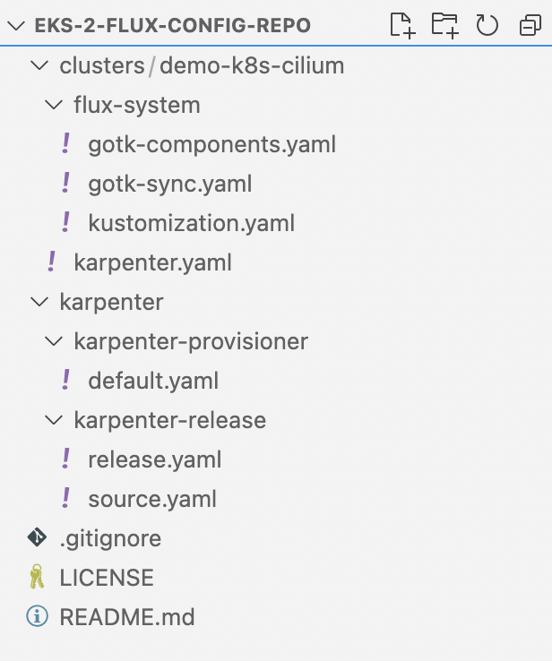
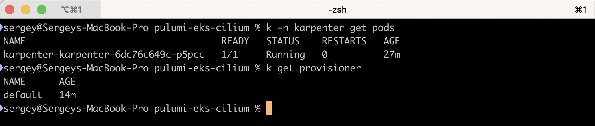
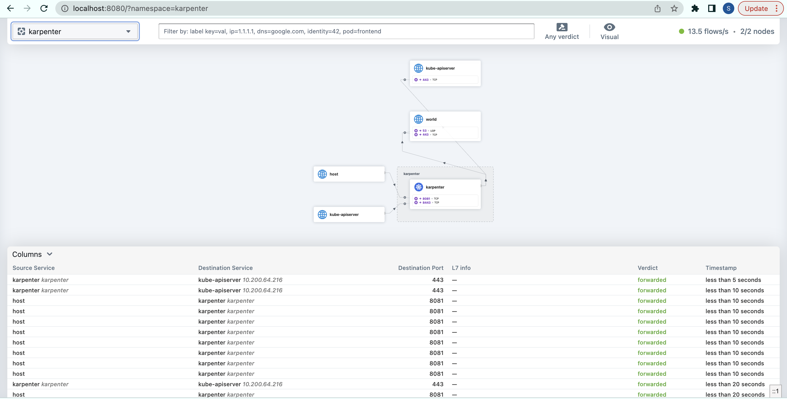

## Introduction

What's up with eBPF? You are likely familiar with the technology and might have heard about [Cilium](https://cilium.io) before from observing the CNCF landscape. [EKS Anywhere](https://anywhere.eks.amazonaws.com/) uses that for pod networking and security, in case you did not know! If not, it's probably best to introduce Cilium by quoting the product website:

>Cilium is an open-source project to provide networking, security, and observability for cloud-native environments such as Kubernetes clusters and other container orchestration platforms.

>At the foundation of Cilium is a new Linux kernel technology called eBPF, which enables the dynamic insertion of powerful security, visibility, and networking control logic into the Linux kernel. eBPF provides high-performance networking, multi-cluster and multi-cloud capabilities, advanced load balancing, transparent encryption, extensive network security capabilities, transparent observability, and much more.


From the 1.12 release onwards, Cilium has become an all-in-one tool encompassing an integrated ingress controller with Layer 7 load-balancing, sidecar-free service mesh, the possibility to inject Envoy configuration anywhere in the network and many other cool features.

We will not get deep into the inner workings of eBPF in this post. Instead, we will build on top of the Pulumi automation we reviewed in [Part 1](https://svodwood.github.io/devops-pastebin/eks-part-one-karpenter-flux/) of the EKS series and operationalize a bare EKS cluster with Cilium, replacing the default AWS kube-proxy and VPC CNI. No Fargate this time. Additionally, there will be a separate EKS series post on Cilium's implementation (and extension) of standard Kubernetes NetworkPolicy.

Pulumi IaC will help us bring up our infrastructure on the AWS Cloud. Check out pulumi.com if you still need to become familiar with it. You can deploy this demo stack using the Pulumi button below.

[](https://app.pulumi.com/new?template=https://github.com/svodwood/pulumi-eks-cilium)

You may find the source code for this demo in [this Github repo](https://github.com/svodwood/pulumi-eks-cilium). A sample Flux configuration repository for this project [is here](https://github.com/svodwood/eks-2-flux-config-repo).

## What We Are Going To Build

We will spin up a demo VPC and a Cilium-enabled EKS cluster. We will additionally create the necessary IAM roles for service accounts to run Cilium and Karpenter in the cluster. Finally, we will initialize a demo workload to check Cilium features using Flux as our GitOps engine.

To start building, we are going to need to meet the prerequisites:
1. An AWS account with a named AWS CLI profile configured.
2. A working Pulumi environment.
3. A GitHub repo to set up the GitOps flow powered by Flux.
4. A GitHub personal access token.
5. [FluxCLI](https://fluxcd.io/flux/cmd/) installed locally.
6. [Cilium CLI](https://github.com/cilium/cilium-cli) installed locally.

## Flux Configuration Repository Set-up

Before launching our Pulumi template, we must set up a Flux repository. This repository will hold all definitions of things running inside our EKS cluster on the applicative level. The demo template assumes we are using a personal public repo on GitHub. Because we will not be using EKS Fargate for this demo, Flux will bootstrap itself as expected without any intervention.

## Pulumi Stack: Basic Infrastructure

As before, we will construct a VPC consisting of public subnets, private subnets for the Kubernetes worker nodes, and dedicated subnets for the EKS Control Plane network interfaces. However, we will only focus on this a little in this particular post since we are re-using the previous stack's components, covered in [Part 1](https://svodwood.github.io/devops-pastebin/eks-part-one-karpenter-flux/). We should still end up with the following:
1. A couple of public subnets for our ingress endpoints.
2. A couple of private subnets for our nodes.
3. A couple of private subnets for our EKS control plane network interfaces.
4. Several VPC endpoints to facilitate network connectivity between our EKS cluster and AWS API in a secure fashion.

## Pulumi Stack: EKS, Cilium, Karpenter, Flux Bootstrap

First, we will highlight several IAM objects necessary to construct our working EKS environment, namely:
1. An EKS service role.
2. An IAM role for the cilium-controller service account.
3. A Karpenter-managed node role and instance profile.

Second, we will spin up an EKS cluster without Fargate profiles. Karpenter namespace is to be created as part of the cluster provisioning routine - bootstrapping the cluster to a minimal working state can be outsourced to Operations and subsequently passed to a development team for consumption. In this example, the development teams, in turn, can adopt the cluster using the established GitOps workflow. In addition, ops teams may use role-based access control to restrict the manipulation of resources in these "operations-managed" namespaces. Additionally, we will create a patch to disable the "aws-node" DaemonSet - we want to outsource proxying capability to Cilium completely. 

To install Cilium, we need a node group. To initialize a node group, we need functioning CNI software. It's a chicken and egg situation, but thankfully, Pulumi will carry out our tasks in parallel to bring everything up eventually. Finally, a Flux bootstrap job will create all Flux controllers in our EKS cluster and set up a connection with our configuration GitHub repository:

```python
"""
Shared EKS resources
"""

# Create an EKS cluster role:
eks_iam_role_policy_arns = [
    "arn:aws:iam::aws:policy/AmazonEKSClusterPolicy",
    "arn:aws:iam::aws:policy/AmazonEKSVPCResourceController"
]

eks_iam_role = create_iam_role(f"{cluster_descriptor}-eks-role", "Service", "eks.amazonaws.com", eks_iam_role_policy_arns)

# Create a default node role for Karpenter:
karpenter_default_nodegroup_role_policy_arns = [
    "arn:aws:iam::aws:policy/AmazonEKSWorkerNodePolicy",
    "arn:aws:iam::aws:policy/AmazonEC2ContainerRegistryReadOnly",
    "arn:aws:iam::aws:policy/AmazonSSMManagedInstanceCore",
    "arn:aws:iam::aws:policy/AmazonEKS_CNI_Policy"
]

# Cilium CNI service account policies:
cni_service_account_policy_arns = [
    "arn:aws:iam::aws:policy/AmazonEKS_CNI_Policy",
    "arn:aws:iam::aws:policy/AmazonEKSWorkerNodePolicy"
]

# Create a default demo EKS cluster nodegroup security group:
demo_nodegroup_security_group = ec2.SecurityGroup(f"custom-node-attach-{cluster_descriptor}",
    description=f"{cluster_descriptor} custom node security group",
    vpc_id=demo_vpc.id,
    tags={**general_tags, "Name": f"custom-node-attach-{cluster_descriptor}", "karpenter.sh/discovery": f"{cluster_descriptor}"}
)

demo_nodegroup_security_group_inbound_custom_cidrs = ec2.SecurityGroupRule(f"inbound-eks-node-{cluster_descriptor}",
    type="ingress",
    from_port=443,
    to_port=443,
    protocol="tcp",
    cidr_blocks=["0.0.0.0/0"],
    security_group_id=demo_nodegroup_security_group.id
)

demo_nodegroup_security_group_oubound_custom_cidrs = ec2.SecurityGroupRule(f"outbound-eks-node-{cluster_descriptor}",
    type="egress",
    to_port=0,
    protocol="-1",
    from_port=0,
    cidr_blocks=["0.0.0.0/0"],
    security_group_id=demo_nodegroup_security_group.id
)

# Create a default demo EKS cluster security group:
demo_cluster_security_group = ec2.SecurityGroup(f"custom-cluster-attach-{cluster_descriptor}",
    description=f"{cluster_descriptor} custom security group",
    vpc_id=demo_vpc.id,
    tags={**general_tags, "Name": f"custom-cluster-attach-{cluster_descriptor}"}
)

demo_cluster_security_group_inbound_custom_cidrs = ec2.SecurityGroupRule(f"inbound-eks-cp-{cluster_descriptor}",
    type="ingress",
    from_port=443,
    to_port=443,
    protocol="tcp",
    cidr_blocks=["0.0.0.0/0"],
    security_group_id=demo_cluster_security_group.id
)

demo_cluster_security_group_oubound_custom_cidrs = ec2.SecurityGroupRule(f"outbound-eks-cp-{cluster_descriptor}",
    type="egress",
    to_port=0,
    protocol="-1",
    from_port=0,
    cidr_blocks=["0.0.0.0/0"],
    security_group_id=demo_cluster_security_group.id
)

# Create a default Karpenter node role and instance profile:
karpenter_node_role = create_iam_role(f"KarpenterNodeRole-{cluster_descriptor}", "Service", "ec2.amazonaws.com", karpenter_default_nodegroup_role_policy_arns)
karpenter_instance_profile = iam.InstanceProfile(f"KarpenterNodeInstanceProfile-{cluster_descriptor}",
    role=karpenter_node_role.name,
    name=f"KarpenterNodeInstanceProfile-{cluster_descriptor}"
)

# Create an EKS log group:
demo_eks_loggroup = cloudwatch.LogGroup("demo-eks-loggroup", 
    name=f"/aws/eks/{cluster_descriptor}/cluster",
    tags=general_tags,
    retention_in_days=1
)

"""
Create an EKS control plane
"""

# Create the cluster control plane:
demo_eks_cluster = eks_provider.Cluster(f"eks-{cluster_descriptor}",
    name=f"{cluster_descriptor}",
    vpc_id=demo_vpc.id,
    instance_role=karpenter_node_role,
    cluster_security_group=demo_cluster_security_group,
    create_oidc_provider=True,
    version="1.24",
    instance_profile_name=karpenter_instance_profile,
    skip_default_node_group=True,
    service_role=eks_iam_role,
    provider_credential_opts=eks_provider.KubeconfigOptionsArgs(
        profile_name=config.profile,
    ),
    endpoint_private_access=True,
    endpoint_public_access=True,
    enabled_cluster_log_types=["api", "audit", "authenticator", "controllerManager", "scheduler"],
    public_access_cidrs=["0.0.0.0/0"],
    subnet_ids=[s.id for s in demo_eks_cp_subnets],
    default_addons_to_remove=["coredns", "kube-proxy", "vpc-cni"],
    tags={**general_tags, "Name": f"{cluster_descriptor}"},
    fargate=False,
    opts=ResourceOptions(depends_on=[
            demo_nodegroup_security_group,
            eks_iam_role,
            demo_eks_loggroup
        ]))

demo_eks_cluster_oidc_arn = demo_eks_cluster.core.oidc_provider.arn
demo_eks_cluster_oidc_url = demo_eks_cluster.core.oidc_provider.url

# Create an IAM role for Cilium CNI:
iam_role_vpc_cni_service_account_role = create_oidc_role(f"{cluster_descriptor}-cilium", "kube-system", demo_eks_cluster_oidc_arn, demo_eks_cluster_oidc_url, "cilium-operator", cni_service_account_policy_arns)
export("cilium-oidc-role-arn", iam_role_vpc_cni_service_account_role.arn)

# Create a Karpenter IAM role scoped to karpenter namespace:
iam_role_karpenter_controller_policy = create_policy(f"{cluster_descriptor}-karpenter-policy", "karpenter_oidc_role_policy.json")
iam_role_karpenter_controller_service_account_role = create_oidc_role(f"{cluster_descriptor}-karpenter", "karpenter", demo_eks_cluster_oidc_arn, demo_eks_cluster_oidc_url, "karpenter", [iam_role_karpenter_controller_policy.arn])
export("karpenter-oidc-role-arn", iam_role_karpenter_controller_service_account_role.arn)

# Create a kubernetes provider:
role_provider = k8s.Provider(f"{cluster_descriptor}-kubernetes-provider",
    kubeconfig=demo_eks_cluster.kubeconfig,
    enable_server_side_apply=True,
    opts=ResourceOptions(depends_on=[demo_eks_cluster])
)

# Patch the aws-node DaemonSet to make sure it's unshedulable to any node in the cluster, using server side apply:
patch_aws_node = k8s.apps.v1.DaemonSetPatch("aws-node-patch",
    metadata=k8s.meta.v1.ObjectMetaPatchArgs(
        annotations={
            "pulumi.com/patchForce": "true",
        },
        name="aws-node",
        namespace="kube-system"
    ),
    spec=k8s.apps.v1.DaemonSetSpecPatchArgs(
        template=k8s.core.v1.PodTemplateSpecPatchArgs(
            spec=k8s.core.v1.PodSpecPatchArgs(
                affinity=k8s.core.v1.AffinityPatchArgs(
                    node_affinity=k8s.core.v1.NodeAffinityPatchArgs(
                        required_during_scheduling_ignored_during_execution=k8s.core.v1.NodeSelectorPatchArgs(
                            node_selector_terms=[k8s.core.v1.NodeSelectorTermPatchArgs(
                                match_expressions=[k8s.core.v1.NodeSelectorRequirementPatchArgs(
                                    key="kubernetes.io/os",
                                    operator="In",
                                    values=["no-schedule"]
                                )]
                            )]
                        )
                    )
                )
            )
        )
    ),
    opts=ResourceOptions(
        provider=role_provider,
        depends_on=[demo_eks_cluster]
    )
)

cluster_endpoint_fqdn = demo_eks_cluster.core.endpoint

"""
Create a managed node group and install Cilium via helm in parallel. A managed nodegroup will fail to reach a "Ready" state 
without the CNI daemon running and the helm chart will fail to install if no nodes are available. Let the race begin!
"""

# Create a cilium Helm release when the control plane is initialized:
cilium_cni_release = Release("cilium-cni",
    ReleaseArgs(
        chart="cilium",
        version=cilium_release_version,
        namespace="kube-system",
        repository_opts=RepositoryOptsArgs(
            repo="https://helm.cilium.io",
        ),
        values=Output.all(iam_role_vpc_cni_service_account_role.arn, cluster_endpoint_fqdn).apply(
            lambda args:
                {
                "ingressController": {
                    "enabled": True,
                },
                "eni": {
                    "enabled": True,
                    "iamRole": args[0]
                },
                "ipam": {
                    "mode": "eni",
                },
                "egressMasqueradeInterfaces": "eth0",
                "tunnel": "disabled",
                "loadBalancer": {
                    "algorithm": "maglev"
                },
                "kubeProxyReplacement": "strict",
                "k8sServiceHost": args[1].replace("https://",""),
                "hubble": {
                    "relay": {
                        "enabled": True,
                    },
                    "ui": {
                        "enabled": True
                    }
                }
            }
        )
    ),
    opts=ResourceOptions(
        provider=role_provider,
        depends_on=[demo_eks_cluster, patch_aws_node]
    )
)

# Create an initial Nodegroup when the control plane is initialized:
initial_managed_nodegroup = eks_provider.ManagedNodeGroup("cilium-initial-nodegroup",
    cluster=demo_eks_cluster,
    node_group_name="initial-nodegroup",
    node_role=karpenter_node_role,
    subnet_ids=[s.id for s in demo_private_subnets],
    force_update_version=True,
    ami_type="BOTTLEROCKET_ARM_64",
    instance_types=["t4g.medium"],
    scaling_config={
        "desired_size": 2,
        "min_size": 2,
        "max_size": 2
    },
    capacity_type="ON_DEMAND",
    tags={**general_tags, "Name": f"cilium-initial-nodegroup"},
    taints=[
        {
            "key": "node.cilium.io/agent-not-ready",
            "value": "true",
            "effect": "NO_EXECUTE"
        }
    ],
    opts=ResourceOptions(
        depends_on=[demo_eks_cluster, patch_aws_node]
    )
)

# Install CoreDNS addon when the cluster is initialized:
core_dns_addon = eks.Addon("coredns-addon",
    cluster_name=f"{cluster_descriptor}",
    addon_name="coredns",
    addon_version="v1.8.7-eksbuild.3",
    resolve_conflicts="OVERWRITE",
    opts=ResourceOptions(
        depends_on=[initial_managed_nodegroup, cilium_cni_release]
    )
)

# Create a service account and cluster role binding for flux controller
flux_service_account = k8s.core.v1.ServiceAccount("flux-controller-service-account",
    api_version="v1",
    kind="ServiceAccount",
    metadata=k8s.meta.v1.ObjectMetaArgs(
        name="flux-controller",
        namespace="kube-system"
    ),
    opts=ResourceOptions(
        provider=role_provider,
        depends_on=[demo_eks_cluster]
    )
)

flux_controller_cluster_role_binding = k8s.rbac.v1.ClusterRoleBinding("flux-controller-sa-crb",
    role_ref=k8s.rbac.v1.RoleRefArgs(
        api_group="rbac.authorization.k8s.io",
        kind="ClusterRole",
        name="cluster-admin"
    ),
    subjects=[
        k8s.rbac.v1.SubjectArgs(
            kind="ServiceAccount",
            name="flux-controller",
            namespace="kube-system"
        )
    ],
    opts=ResourceOptions(
        provider=role_provider,
        depends_on=[demo_eks_cluster]
    )
)

# Create the bootstrap job for flux-cli
flux_bootstrap_job = k8s.batch.v1.Job("fluxBootstrapJob",
    opts=ResourceOptions(
        provider=role_provider,
        depends_on=[flux_service_account, flux_controller_cluster_role_binding, core_dns_addon]
    ),
    metadata=k8s.meta.v1.ObjectMetaArgs(
        name="flux-bootstrap-job",
        namespace="kube-system",
        annotations={"pulumi.com/replaceUnready": "true"}
    ),
    spec=k8s.batch.v1.JobSpecArgs(
        backoff_limit=3,
        template=k8s.core.v1.PodTemplateSpecArgs(
            spec=k8s.core.v1.PodSpecArgs(
                service_account_name="flux-controller",
                containers=[k8s.core.v1.ContainerArgs(
                    env=[k8s.core.v1.outputs.EnvVar(
                        name="GITHUB_TOKEN",
                        value=flux_github_token
                    )],
                    command=[
                        "flux",
                        "bootstrap",
                        "github",
                        f"--owner={flux_github_repo_owner}",
                        f"--repository={flux_github_repo_name}",
                        f"--path=./clusters/{cluster_descriptor}",
                        "--private=false",
                        "--personal=true"
                    ],
                    image=f"fluxcd/flux-cli:v{flux_cli_version}",
                    name="flux-bootstrap",
                )],
                restart_policy="OnFailure",
            ),
        ),
    ))

# Create a karpenter namespace:
karpenter_namespace = k8s.core.v1.Namespace("karpenter-namespace",
    metadata={"name": "karpenter"},
    opts=ResourceOptions(
        provider=role_provider,
        depends_on=[demo_eks_cluster]
    )
)
```

When the stack is up, let's go ahead and add Karpenter to our Flux configuration repository. This time, we will create all the necessary files and push them to the repo:



We create a single file ```karpenter.yaml``` in the cluster's directory to map the dependency between Karpenter's Helm release and the Provisioner:
```yaml
---
apiVersion: kustomize.toolkit.fluxcd.io/v1beta2
kind: Kustomization
metadata:
  name: karpenter-release
  namespace: flux-system
spec:
  interval: 5m
  retryInterval: 1m
  timeout: 10m
  sourceRef:
    kind: GitRepository
    name: flux-system
  path: ./karpenter/karpenter-release
  prune: true
  wait: true
---
apiVersion: kustomize.toolkit.fluxcd.io/v1beta2
kind: Kustomization
metadata:
  name: karpenter-provisioners
  namespace: flux-system
spec:
  dependsOn:
    - name: karpenter-release
  interval: 5m
  retryInterval: 1m
  timeout: 10m
  sourceRef:
    kind: GitRepository
    name: flux-system
  path: ./karpenter/karpenter-provisioner
  prune: true
  wait: true
```

We place the actual Flux definitions in the root of our configuration repository.

Contents of ```./karpenter/karpenter-release/source.yaml```:

```yaml
---
apiVersion: source.toolkit.fluxcd.io/v1beta2
kind: HelmRepository
metadata:
  name: karpenter
  namespace: karpenter
spec:
  interval: 1m
  url: oci://public.ecr.aws/karpenter
  type: oci
```

Contents of ```./karpenter/karpenter-release/release.yaml```:

```yaml
apiVersion: helm.toolkit.fluxcd.io/v2beta1
kind: HelmRelease
metadata:
  name: karpenter
  namespace: karpenter
spec:
  targetNamespace: karpenter
  interval: 5m
  chart:
    spec:
      chart: karpenter
      version: v0.19.2
      sourceRef:
        kind: HelmRepository
        name: karpenter
        namespace: karpenter
      interval: 10m
  values:
    replicas: 1
    serviceAccount:
      create: true
      name: "karpenter"
      annotations:
        eks.amazonaws.com/role-arn: arn:aws:iam::289512055556:role/demo-k8s-cilium-karpenter
    settings:
      aws:
        clusterName: "demo-k8s-cilium"
        clusterEndpoint: "https://38FF0DCDA70C42D8F589305FF132A172.gr7.eu-central-1.eks.amazonaws.com"
        defaultInstanceProfile: "KarpenterNodeInstanceProfile-demo-k8s-cilium"
    logLevel: info
  install:
    crds: CreateReplace
  upgrade:
    crds: CreateReplace
```

Contents of ```./karpenter/karpenter-provisioner/default.yaml```:

```yaml
apiVersion: karpenter.sh/v1alpha5
kind: Provisioner
metadata:
  name: default
spec:
  labels:
    node-type: demo-karpenter
  requirements:
    - key: "karpenter.sh/capacity-type"
      operator: In
      values: ["on-demand"]
    - key: "kubernetes.io/arch"
      operator: In
      values: ["arm64"]
    - key: "node.kubernetes.io/instance-type"
      operator: In
      values: ["t4g.small", "t4g.medium", "t4g.large"]
  limits:
    resources:
      cpu: 10
      memory: 10Gi
  providerRef:
    name: default
  ttlSecondsAfterEmpty: 30
  ttlSecondsUntilExpired: 43200
---
apiVersion: karpenter.k8s.aws/v1alpha1
kind: AWSNodeTemplate
metadata:
  name: default
spec:
  amiFamily: Bottlerocket
  subnetSelector:
    karpenter.sh/discovery: demo-k8s-cilium
  securityGroupSelector:
    karpenter.sh/discovery: demo-k8s-cilium
  tags:
    Name: "KarpenterWorkerNode"
```
Verify that everything is up and running:



## Checking out Hubble UI

Let's go ahead and verify our Cilium installation via Hubble UI by port-forwarding the UI service:

``` kubectl -n kube-system port-forward svc/hubble-ui 8080:80 ```

It looks like everything is in order:



## Summing It All Up

We successfully initialized an EKS cluster with a managed node group running Cilium, Flux and Karpenter. Cilium acts as a kube-proxy replacement in our specific case. In the next part of the EKS series, we will explore Cilium's implementation (and extension) of standard Kubernetes NetworkPolicy, ingress capability and Envoy configuration. Stay tuned!

## Cleaning Up

Before running ```pulumi destroy```, it is best to run ```flux uninstall``` first to remove all finalizers that might otherwise interfere with the stack's resources and delete the EC2 instances that Karpenter spun up for us. Then, after Flux is uninstalled and the instances are terminated, run ```pulumi destroy``` to clean up.