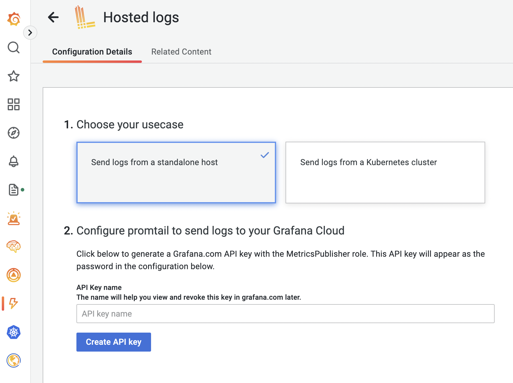
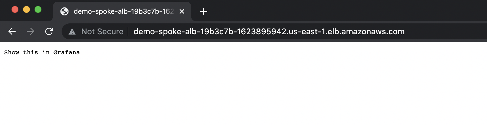
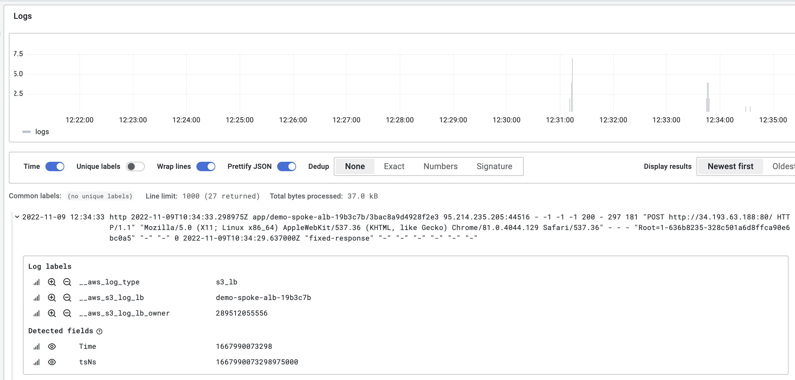

## Introduction

An AWS Application Load Balancer is a simple and convenient AWS construct to implement cloud-native Layer 7 load balancing. For public-facing and private Application Load Balancers, we sometimes need to store and analyze access logs to create graphs and alerts or for general troubleshooting purposes. One of the possible ways to achieve this is by sending ALB access logs to a customer's S3 bucket of choice. [Lambda-promtail](https://github.com/grafana/loki/tree/main/tools/lambda-promtail), in turn, allows sending ALB access logs stored in S3 to a Loki endpoint. 

In this post, I will demonstrate the concept of collecting access log data from several S3 buckets in different spoke accounts with the help of a single lambda-promtail instance running in a hub account. A common occurrence within an enterprise hub and spoke use case is when different teams utilize separate AWS accounts and virtual networks for application delivery. We will use Grafana Cloud (free tier) to receive the data via Grafana’s managed Loki endpoint.

Pulumi IaC will help us bring up our infrastructure on the AWS Cloud. Check out [pulumi.com](https://pulumi.com) if you still need to become familiar with it. You can deploy this demo stack using the Pulumi buttons below.

> Keep in mind that sending data from a VPC-bound Lambda function to a public Loki endpoint will incur costs for NAT gateways and outbound data transfer.

You may find the source code for this demo in [this Github repo](https://github.com/svodwood/pulumi-lambda-promtail-aws-multiacc).

## What We Are Going To Build 

I separated the infrastructure into two Pulumi stacks: the hub and the spoke. For simplicity's sake, we will not use stack references here. So mind the bucket name variable present in both stacks. The value has to be the same across both stacks for everything to work as expected:
```yaml
log-bucket-name: <your_unique_bucket_name>
```

To start building, we are going to need to meet the prerequisites:
1. One "hub" AWS account for the lambda-promtail instance.
2. One "spoke" AWS account to host our Application Load Balancer and an S3 bucket for the logs.
3. Two named AWS CLI profiles for the hub and for the spoke, respectively.
4. A Grafana Cloud account with an auto-generated Loki endpoint connection string.
5. A container image URL of lambda-promtail, uploaded to the private ECR registry of the "hub" account.
6. A working Pulumi environment.

An S3 bucket policy in the spoke account will use the Lambda ARN obtained from the hub account. Therefore, we will deploy the hub stack first to define the Lambda ARN without utilising stack references.

> Ensure the ECR image and both accounts share the same AWS region.

## Grafana Cloud

To simplify our installation, we will use managed Loki in Grafana Cloud. Once in the Grafana UI, proceed to "Integrations and Connections". Search for "Hosted logs" and proceed to generate the API key, selecting the option "Send logs from a standalone host":



Hold on to the generated connection string - we will use it later to configure our lambda-promtail instance. 

## Hub AWS Account: Lambda-promtail

To start the deployment, click the button below or keep reading. 

[](https://app.pulumi.com/new?template=https://github.com/svodwood/pulumi-lambda-promtail-aws-multiacc/tree/main/lambda-promtail-hub)

The hub account will host our lambda-promtail instance, which will fetch data from S3 in the spoke account. We will need a single-az VPC to run the AWS Lambda function. For the sake of simplicity, we are not going to lock into a specific availability zone id during object creation, but this ideally has to be done to minimize data transfer costs in a production environment. Although, a multi-az setup is a recommended option in a real-world scenario. Additionally, the VPC will include an S3 Interface endpoint to reach the bucket's contents - to minimize charges for outgoing traffic from the VPC towards the internet. 

When the stack is up, please note Lambda's IAM role ARN and the ARN of the function itself via stack export variables:
```yaml
lambda-promtail-role-arn: <role_arn_output>
lambda-promtail-function-arn: <function_arn_output>
```

Locate the ```WRITE_ADDRESS``` environment variable in the lambda function definition (promtail_lambda.py) and run "pulumi up". You may parametrize the connection string and convert the variable into a Pulumi secret!
```python
# Create the Lambda function from the ECR image:
demo_promtail_lambda_function = lambda_.Function("demo-lambda-promtail",
    name="lambda_promtail",
    image_uri=demo_promtail_image_uri,
    role=demo_promtail_role.arn,
    memory_size=256,
    timeout=60,
    architectures=["arm64"],
    package_type="Image",
    vpc_config=lambda_.FunctionVpcConfigArgs(
        subnet_ids=[demo_private_subnet.id],
        security_group_ids=[demo_sg.id],
    ),
    environment=lambda_.FunctionEnvironmentArgs(
        variables={
            "WRITE_ADDRESS": "", <-- Loki connection string
            "USERNAME": "",
            "PASSWORD": "",
            "BEARER_TOKEN": "",
            "KEEP_STREAM": "",
            "BATCH_SIZE": "",
            "EXTRA_LABELS": "",
            "TENANT_ID": ""
        },
    ),
    tags=general_tags)
```

You may find the source code for the stack in the [lambda-promtail-hub](https://github.com/svodwood/pulumi-lambda-promtail-aws-multiacc/tree/main/lambda-promtail-hub) directory of the project's repository.

## Spoke AWS Account: ALB and S3

To start the deployment, click the button below or keep reading.

[](https://app.pulumi.com/new?template=https://github.com/svodwood/pulumi-lambda-promtail-aws-multiacc/tree/main/lambda-promtail-spoke)

The spoke stack will emulate our random application team's account - it will host one Application Load Balancer with a dummy target group and an S3 bucket. We will modify the default bucket policy to allow the ALB to publish logs to the bucket and for the lambda-promtail instance in the hub account to read the log data.

Populate the required variables obtained from the hub account:
```yaml
lambda-promtail-role-arn: <role_arn_output>
lambda-promtail-function-arn: <function_arn_output>
log-bucket-name: <your_unique_bucket_name>
```

To allow our Application Load Balancer to write logs to S3, we need to grant the regional Load Balancing AWS account-specific permissions via a Bucket Policy. For this, we need to select a correct load balancer account id from the ones listed [here](https://docs.aws.amazon.com/elasticloadbalancing/latest/application/enable-access-logging.html#attach-bucket-policy). If you are deploying the stacks in us-east-1, the default stack value will be correct out of the box. If you chose a different deployment region, replace the configuration variable with a valid id.

When the stack is up, obtain the Application Load Balancer's DNS name and open it in your browser:



The access log should land in the S3 bucket in a few seconds. An S3 notification will trigger lambda-promtail in our hub account, forcing promtail to parse the event message, obtain the log file object's name, fetch it and post its contents to our Loki endpoint.



You may find the source code for the stack in the [lambda-promtail-spoke](https://github.com/svodwood/pulumi-lambda-promtail-aws-multiacc/tree/main/lambda-promtail-spoke) directory of the project's repository.

## Cleaning Up

Clean up by running ```pulumi destroy```. Start by destroying the spoke account resources, then continue to the hub.
If the S3 bucket fails to delete, try manually removing the objects inside by running the command:

```bash
aws s3 rm s3://<your_unique_bucket_name> --recursive --profile <spoke-aws-profile>
```