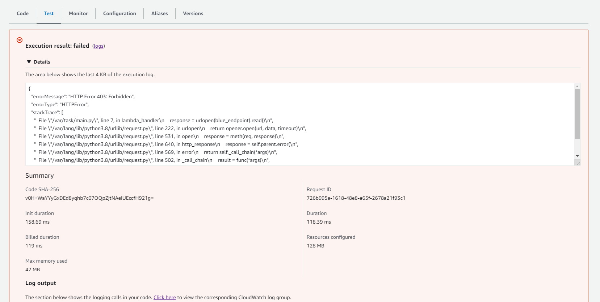

## Introduction

In Part 1 of the series, we looked at some of the benefits and drawbacks of VPC Lattice and theorized on possible use cases where this managed service might be helpful. We also discussed a "shared service" scenario, where some individual applications may desire access to a shared service while belonging to entirely separate networks. This pattern might present itself with a commonly shared HTTP endpoint - for example, for token generation and validation, tied to a shared encryption infrastructure. While not straightforward, utilizing VPC Lattice to support this topology is possible. Let's now dive deeper and construct a functional multi-account and multi-VPC mini-landing zone - utilizing VPC Lattice as an application layer network.

Pulumi IaC will help us bring up our infrastructure on the AWS Cloud. Check out pulumi.com if you still need to become familiar with it. You can deploy these demo stacks using the Pulumi buttons below.

You may find the source code for this demo in [this Github repo](https://github.com/svodwood/vpc-lattice-lab-1).

>Disclaimer #1: in the Pulumi stacks, we use two AWS providers: aws and aws-native, which need separate configurations, e.g., AWS CLI profile name and region. The latter is the only option to work with Lattice from Pulumi. I cannot currently recommend the aws-native provider for production use.

>Disclaimer #2: at the time of writing, some requests to VPC Lattice API return 429. AWS is still throttling requests to the service, although this may be related to your account status. Run "pulumi up" one more time if you experience this.

## What We Are Going To Build

Our focus today is on our hypothetical company's three microservices:
1. DirectoryService. A shared microservice.
2. BlueService. A standalone microservice.
3. GreenService. A standalone microservice.

Separate development teams own the BlueService and the GreenService, respectively - each team has an isolated AWS account where they develop their microservices. An independent team maintains the third application (DirectoryService) and controls access to the application. This application runs in the third isolated AWS account.

Our network isolation requirements define that the GreenService must not be in the same network as the BlueService. Both services, however, need to perform HTTP GET requests to the DirectoryService - using dedicated query strings.

Below is the high-level diagram of the landing zone topology and network isolation requirements:


To start building, we are going to need to meet the prerequisites:
1. Three separate AWS accounts belong to a single AWS Organization. Additionally, we must enable RAM sharing across the Organization.
2. Three configured CLI profiles - for all three accounts, respectively. Mind that the aws:profile and aws-native:profile providers must be configured explicitly and separately. They may, however, reuse the same credentials.
3. A working Pulumi environment.
4. Account IDs of all three AWS accounts.

## Pulumi Stacks and Deployment Procedures

Our lab repository consists of three directories, each corresponding to a separate Pulumi stack:
1. ./a-common-service
2. ./b-blue-service
3. ./c-green-service

A "common-service" stack contains the infrastructure for the DirectoryService application deployed to a separate AWS account. This specific account also owns the two independent VPC Lattice Service Networks: 
1. One is to control the communication with the GreenService.
2. Another is to control the communication with BlueService.

We share the Service Networks with the respective microservice accounts via AWS RAM. As such, we provision the stacks in the same order listed above. Once the "common-service" stack is up, note the two VPC Lattice Service Networks - we must use their ARNs in the blue and green stack configurations, respectively. For simplicity, we will not use stack imports here and will copy-paste the correct values of the "common-service" stack output. Also, make a note of the "shared-service-fqdn" output value. Then, copy-paste that into both "blue-service" and "green-service" stack inputs.

Deploy the Common Service:
[](https://app.pulumi.com/new?template=https://github.com/svodwood/vpc-lattice-lab-1/tree/main/a-common-service)

Deploy the Blue Service:
[](https://app.pulumi.com/new?template=https://github.com/svodwood/vpc-lattice-lab-1/tree/main/b-blue-service)

Deploy the Green Service:
[](https://app.pulumi.com/new?template=https://github.com/svodwood/vpc-lattice-lab-1/tree/main/c-green-service)

## Pulumi Stack: Common Service

Our "common-service" stack consists of essential VPC components, Lattice-specific network components, AWS RAM shares and a Lambda function running FastAPI. In addition, we use a private Application Load Balancer to front our Lambda function. First, let's break down the stack.

Our Pulumi project consists of the following files:
1. settings.py - holds generic settings and Pulumi configuration variables.
2. helpers.py - holds generic helper functions, if any.
3. vpc.py - constructs three VPCs in our shared service AWS account.
4. lattice.py - constructs Lattice Service Networks, associates them with the correct VPCs and shares them with the correct AWS accounts.
5. app_infra.py - constructs everything around the Lambda function, including the ALB, IAM and the Lambda itself.
6. main.py - executes the code.

First, we define the settings and fetch configuration variables (settings.py):

```python
from pulumi import Config

"""
Various stack settings.
Below baseline tags must be applied to all created resources without exception:
1.  Key: "Account"
    Values: ["Management", "GreenSandbox", "BlueSandbox", "SharedServices"]
2.  Key: "AccountType"
    Values: ["Management", "Workload"]
3.  Key: "Provisioned"
    Values: ["Manually", "Pulumi", "Terraform", "Other"]
4.  Key: "StackName"
    Values: ["<project-name-here>"]
"""
pulumi_config = Config()
provider_config = Config("aws")
deployment_region = provider_config.require("region")

baseline_cost_tags = {
    "Account": "SharedServices",
    "AccountType": "Workload",
    "Provisioned": "Pulumi",
    "StackName": "common-service"
}

baseline_cost_tags_native = [
    {
        "key": "AccountType",
        "value": "Workload"
    },
    {
        "key": "Account",
        "value": "SharedServices"
    },
    {
        "key": "Provisioned",
        "value": "Pulumi"
    },
    {
        "key": "StackName",
        "value": "common-service"
    }
]

shared_services_main_vpc_cidr = "10.0.0.0/16"

shared_service_subnet_cidrs_pub = [
    "10.0.0.0/22",
    "10.0.4.0/22"
]

shared_service_subnet_cidrs_app = [
    "10.0.8.0/22",
    "10.0.12.0/22"
]

"""
VPC Lattice Local Peers
"""
blue_network_vpc_cidr = "192.168.0.0/23"
blue_subnet_cidrs = [ 
    "192.168.0.0/24",
    "192.168.1.0/24"	
]

green_network_vpc_cidr = "192.168.2.0/23"
green_subnet_cidrs = [ 
    "192.168.2.0/24",
    "192.168.3.0/24"	
]

"""
VPC Lattice Dev Accounts
"""
green_principal = pulumi_config.require("green-principal")
blue_principal = pulumi_config.require("blue-principal")
```

Second, get some helpers (helpers.py):

```python
from pulumi_aws import get_caller_identity, get_availability_zones

"""
Various stack helper functions and configuration variables.
"""

current_account = get_caller_identity()
current_account_id = current_account.account_id
demo_azs = get_availability_zones(state="available").names
```

Thirdly, construct the VPCs (vpc.py):

```python
from pulumi_aws import ec2
from pulumi import ResourceOptions

from settings import baseline_cost_tags, deployment_region, shared_services_main_vpc_cidr, blue_network_vpc_cidr, green_network_vpc_cidr, blue_subnet_cidrs, green_subnet_cidrs, shared_service_subnet_cidrs_pub, shared_service_subnet_cidrs_app
from helpers import demo_azs

"""
Constructs Shared Services main VPC:
"""
shared_services_main_vpc = ec2.Vpc("SharedServicesMainVpc",
    cidr_block=shared_services_main_vpc_cidr,
    enable_dns_hostnames=True,
    enable_dns_support=True,
    tags={**baseline_cost_tags, "Name": f"SharedServicesMainVpc-{deployment_region}"}
)

shared_services_main_igw = ec2.InternetGateway("SharedServicesMainVpcIgw",
    vpc_id=shared_services_main_vpc.id,
    tags={**baseline_cost_tags, "Name": f"SharedServicesMainVpcIgw-{deployment_region}"},
    opts=ResourceOptions(parent=shared_services_main_vpc)
)

"""
Constructs secondary VPCs for peering and Lattice connection:
"""
green_network_vpc = ec2.Vpc("GreenNetworkVpc",
    cidr_block=green_network_vpc_cidr,
    enable_dns_hostnames=True,
    enable_dns_support=True,
    tags={**baseline_cost_tags, "Name": f"GreenNetworkVpc-{deployment_region}"}
)

blue_network_vpc = ec2.Vpc("BlueNetworkVpc",
    cidr_block=blue_network_vpc_cidr,
    enable_dns_hostnames=True,
    enable_dns_support=True,
    tags={**baseline_cost_tags, "Name": f"BlueNetworkVpc-{deployment_region}"}
)

"""
Establishes VPC peering connections:
"""
green_peering_connection = ec2.VpcPeeringConnection("GreenPeeringConnection",
    vpc_id=shared_services_main_vpc.id,
    peer_vpc_id=green_network_vpc.id,
    auto_accept=True,
    opts=ResourceOptions(
        parent=shared_services_main_vpc,
        depends_on=[
            shared_services_main_vpc,
            green_network_vpc
        ]
    )
)

green_peering_connection_options = ec2.PeeringConnectionOptions("GreenPeeringConnectionOptions",
    vpc_peering_connection_id=green_peering_connection.id,
    accepter=ec2.PeeringConnectionOptionsAccepterArgs(
        allow_remote_vpc_dns_resolution=True,
    ),
    requester=ec2.PeeringConnectionOptionsRequesterArgs(
        allow_remote_vpc_dns_resolution=True,
    ),
    opts=ResourceOptions(
        parent=green_peering_connection,
        depends_on=[
            green_peering_connection
        ]
    )
)

blue_peering_connection = ec2.VpcPeeringConnection("BluePeeringConnection",
    vpc_id=shared_services_main_vpc.id,
    peer_vpc_id=blue_network_vpc.id,
    auto_accept=True,
    opts=ResourceOptions(
        parent=shared_services_main_vpc,
        depends_on=[
            shared_services_main_vpc,
            blue_network_vpc
        ]
    )
)

blue_peering_connection_options = ec2.PeeringConnectionOptions("BluePeeringConnectionOptions",
    vpc_peering_connection_id=blue_peering_connection.id,
    accepter=ec2.PeeringConnectionOptionsAccepterArgs(
        allow_remote_vpc_dns_resolution=True,
    ),
    requester=ec2.PeeringConnectionOptionsRequesterArgs(
        allow_remote_vpc_dns_resolution=True,
    ),
    opts=ResourceOptions(
        parent=blue_peering_connection,
        depends_on=[
            blue_peering_connection
        ]
    )
)

"""
Constructs Shared Services main VPC's subnets:
"""
shared_services_pub_subnets = []
shared_services_app_subnets = []

for i in range(2):
    prefix = f"{demo_azs[i]}"

    shared_service_subnet_pub = ec2.Subnet(f"SharedServiceSubnetPub-{prefix}",
        vpc_id=shared_services_main_vpc.id,
        cidr_block=shared_service_subnet_cidrs_pub[i],
        availability_zone=demo_azs[i],
        tags={**baseline_cost_tags, "Name": f"SharedServiceSubnetPub-{prefix}"},
        opts=ResourceOptions(parent=shared_services_main_vpc)
    )

    shared_services_pub_subnets.append(shared_service_subnet_pub)

    shared_service_rt_pub = ec2.RouteTable(f"SharedServiceRtPub-{prefix}",
        vpc_id=shared_services_main_vpc.id,
        tags={**baseline_cost_tags, "Name": f"SharedServiceRtPub-{prefix}"},
        opts=ResourceOptions(parent=shared_service_subnet_pub)
    )

    shared_service_rt_pub_association = ec2.RouteTableAssociation(f"SharedServiceRtaPub-{prefix}",
        route_table_id=shared_service_rt_pub.id,
        subnet_id=shared_service_subnet_pub.id,
        opts=ResourceOptions(parent=shared_service_subnet_pub)
    )

    shared_service_pub_route_to_wan = ec2.Route(f"WanPubRoute-{prefix}",
        route_table_id=shared_service_rt_pub.id,
        gateway_id=shared_services_main_igw.id,
        destination_cidr_block="0.0.0.0/0",
        opts=ResourceOptions(
            parent=shared_service_rt_pub
        )
    )

    shared_service_subnet_app = ec2.Subnet(f"SharedServiceSubnetApp-{prefix}",
        vpc_id=shared_services_main_vpc.id,
        cidr_block=shared_service_subnet_cidrs_app[i],
        availability_zone=demo_azs[i],
        tags={**baseline_cost_tags, "Name": f"SharedServiceSubnetApp-{prefix}"},
        opts=ResourceOptions(parent=shared_services_main_vpc)
    )

    shared_services_app_subnets.append(shared_service_subnet_app)

    shared_service_rt_app = ec2.RouteTable(f"SharedServiceRtApp-{prefix}",
        vpc_id=shared_services_main_vpc.id,
        tags={**baseline_cost_tags, "Name": f"SharedServiceRtApp-{prefix}"},
        opts=ResourceOptions(parent=shared_service_subnet_app)
    )

    shared_service_rt_app_association = ec2.RouteTableAssociation(f"SharedServiceAppRta-{prefix}",
        route_table_id=shared_service_rt_app.id,
        subnet_id=shared_service_subnet_app.id,
        opts=ResourceOptions(parent=shared_service_subnet_app)
    )

    shared_service_route_to_green = ec2.Route(f"RouteToGreenPeer-{prefix}",
        route_table_id=shared_service_rt_app.id,
        vpc_peering_connection_id=green_peering_connection.id,
        destination_cidr_block=green_network_vpc_cidr,
        opts=ResourceOptions(
            parent=shared_service_rt_app,
            depends_on=[green_peering_connection]
        )
    )

    shared_service_route_to_blue = ec2.Route(f"RouteToBluePeer-{prefix}",
        route_table_id=shared_service_rt_app.id,
        vpc_peering_connection_id=blue_peering_connection.id,
        destination_cidr_block=blue_network_vpc_cidr,
        opts=ResourceOptions(
            parent=shared_service_rt_app,
            depends_on=[blue_peering_connection]
        )
    )

"""
Constructs green network peer subnets:
"""
green_peer_subnets = []

for i in range(2):
    prefix = f"{demo_azs[i]}"

    green_peer_subnet = ec2.Subnet(f"GreenPeerSubnet-{prefix}",
        vpc_id=green_network_vpc.id,
        cidr_block=green_subnet_cidrs[i],
        availability_zone=demo_azs[i],
        tags={**baseline_cost_tags, "Name": f"GreenPeerSubnet-{prefix}"},
        opts=ResourceOptions(parent=green_network_vpc)
    )

    green_peer_subnets.append(green_peer_subnet)
    
    green_peer_rt = ec2.RouteTable(f"GreenPeerRt-{prefix}",
        vpc_id=green_network_vpc.id,
        tags={**baseline_cost_tags, "Name": f"GreenPeerRt-{prefix}"},
        opts=ResourceOptions(parent=green_peer_subnet)
    )

    green_peer_rt_association = ec2.RouteTableAssociation(f"GreenPeerRta-{prefix}",
        route_table_id=green_peer_rt.id,
        subnet_id=green_peer_subnet.id,
        opts=ResourceOptions(parent=green_peer_subnet)
    )

    green_peer_main_route = ec2.Route(f"GreenPeerMainRoute-{prefix}",
        route_table_id=green_peer_rt.id,
        vpc_peering_connection_id=green_peering_connection.id,
        destination_cidr_block=shared_services_main_vpc_cidr,
        opts=ResourceOptions(
            parent=green_peer_rt,
            depends_on=[green_peering_connection]
        )
    )


"""
Constructs blue network peer subnets:
"""
blue_peer_subnets = []

for i in range(2):
    prefix = f"{demo_azs[i]}"

    blue_peer_subnet = ec2.Subnet(f"BluePeerSubnet-{prefix}",
        vpc_id=blue_network_vpc.id,
        cidr_block=blue_subnet_cidrs[i],
        availability_zone=demo_azs[i],
        tags={**baseline_cost_tags, "Name": f"BluePeerSubnet-{prefix}"},
        opts=ResourceOptions(parent=blue_network_vpc)
    )

    blue_peer_subnets.append(blue_peer_subnet)
    
    blue_peer_rt = ec2.RouteTable(f"BluePeerRt-{prefix}",
        vpc_id=blue_network_vpc.id,
        tags={**baseline_cost_tags, "Name": f"BluePeerRt-{prefix}"},
        opts=ResourceOptions(parent=blue_peer_subnet)
    )

    blue_peer_rt_association = ec2.RouteTableAssociation(f"BluePeerRta-{prefix}",
        route_table_id=blue_peer_rt.id,
        subnet_id=blue_peer_subnet.id,
        opts=ResourceOptions(parent=blue_peer_subnet)
    )

    blue_peer_main_route = ec2.Route(f"BluePeerMainRoute-{prefix}",
        route_table_id=blue_peer_rt.id,
        vpc_peering_connection_id=blue_peering_connection.id,
        destination_cidr_block=shared_services_main_vpc_cidr,
        opts=ResourceOptions(
            parent=blue_peer_rt,
            depends_on=[blue_peering_connection]
        )
    )

"""
Creates demo security groups in the Green and Blue VPCs:
"""
green_lattice_sg = ec2.SecurityGroup("GreenSecurityGroup",
    description="Green Lattice Security Group",
    vpc_id=green_network_vpc.id,
    ingress=[ec2.SecurityGroupIngressArgs(
        description="Any",
        from_port=0,
        to_port=0,
        protocol="-1",
        cidr_blocks=["0.0.0.0/0"],
        ipv6_cidr_blocks=["::/0"],
    )],
    egress=[ec2.SecurityGroupEgressArgs(
        from_port=0,
        to_port=0,
        protocol="-1",
        cidr_blocks=["0.0.0.0/0"],
        ipv6_cidr_blocks=["::/0"],
    )],
    tags={**baseline_cost_tags, "Name": f"GreenSecurityGroup-{deployment_region}"},
    opts=ResourceOptions(parent=green_network_vpc)
)

blue_lattice_sg = ec2.SecurityGroup("BlueSecurityGroup",
    description="Blue Lattice Security Group",
    vpc_id=blue_network_vpc.id,
    ingress=[ec2.SecurityGroupIngressArgs(
        description="Any",
        from_port=0,
        to_port=0,
        protocol="-1",
        cidr_blocks=["0.0.0.0/0"],
        ipv6_cidr_blocks=["::/0"],
    )],
    egress=[ec2.SecurityGroupEgressArgs(
        from_port=0,
        to_port=0,
        protocol="-1",
        cidr_blocks=["0.0.0.0/0"],
        ipv6_cidr_blocks=["::/0"],
    )],
    tags={**baseline_cost_tags, "Name": f"BlueSecurityGroup-{deployment_region}"},
    opts=ResourceOptions(parent=blue_network_vpc)
)

"""
Creates a demo security group in the main VPC, to be used with the Application Load Balancer:
"""
main_lambda_alb_sg = ec2.SecurityGroup("MainLambdaAlbSecurityGroup",
    description="ALB Security Group",
    vpc_id=shared_services_main_vpc.id,
    ingress=[ec2.SecurityGroupIngressArgs(
        description="Any",
        from_port=0,
        to_port=0,
        protocol="-1",
        cidr_blocks=["0.0.0.0/0"],
        ipv6_cidr_blocks=["::/0"],
    )],
    egress=[ec2.SecurityGroupEgressArgs(
        from_port=0,
        to_port=0,
        protocol="-1",
        cidr_blocks=["0.0.0.0/0"],
        ipv6_cidr_blocks=["::/0"],
    )],
    tags={**baseline_cost_tags, "Name": f"MainLambdaAlbSecurityGroup-{deployment_region}"},
    opts=ResourceOptions(parent=shared_services_main_vpc)
)
```

Fourthly, create Lattice networks (lattice.py):

```python
from pulumi_aws_native import vpclattice
from pulumi_aws import ram
from pulumi import ResourceOptions, export

from settings import baseline_cost_tags, deployment_region, baseline_cost_tags_native, green_principal, blue_principal
from vpc import green_network_vpc, blue_network_vpc, green_lattice_sg, blue_lattice_sg

"""
Creates the RAM shares for Lattice service networks:
"""
green_ram_share = ram.ResourceShare("GreenLatticeRamShare",
    allow_external_principals=False, # Make note that this share will not work outside your AWS Organization by default, set to True if needed
    tags=baseline_cost_tags
)

blue_ram_share = ram.ResourceShare("BlueLatticeRamShare",
    allow_external_principals=False, # Make note that this share will not work outside your AWS Organization by default, set to True if needed
    tags=baseline_cost_tags
)

"""
Associates principals to the RAM shares:
"""
green_principal_association = ram.PrincipalAssociation("GreenPrincipalAssociation",
    principal=green_principal,
    resource_share_arn=green_ram_share.arn
)

blue_principal_association = ram.PrincipalAssociation("BluePrincipalAssociation",
    principal=blue_principal,
    resource_share_arn=blue_ram_share.arn
)

"""
Constructs green and blue service networks:
"""
green_service_network = vpclattice.ServiceNetwork("GreenServiceNetwork",
    auth_type="NONE",
    name="green-service-network",
    tags=baseline_cost_tags_native
)

export("green-service-network-arn", green_service_network.arn)

blue_service_network = vpclattice.ServiceNetwork("BlueServiceNetwork",
    auth_type="NONE",
    name="blue-service-network",
    tags=baseline_cost_tags_native
)

export("blue-service-network-arn", blue_service_network.arn)

"""
Adds service networks to respective RAM shares:
"""
green_ram_share_association = ram.ResourceAssociation("GreenLatticeRamShareAssociation",
    resource_arn=green_service_network.arn,
    resource_share_arn=green_ram_share.arn,
    opts=ResourceOptions(
        parent=green_ram_share,
        depends_on=[
            green_service_network
        ]
    )
)

blue_ram_share_association = ram.ResourceAssociation("BlueLatticeRamShareAssociation",
    resource_arn=blue_service_network.arn,
    resource_share_arn=blue_ram_share.arn,
    opts=ResourceOptions(
        parent=blue_ram_share,
        depends_on=[
            blue_service_network
        ]
    )
)

"""
Adds service netowork VPC associations (Green Peer and Blue Peer in SharedServices):
"""
green_service_network_vpc_association = vpclattice.ServiceNetworkVpcAssociation("GreenServiceNetworkVpcAssociation",
    security_group_ids=[green_lattice_sg.id],
    service_network_identifier=green_service_network,
    vpc_identifier=green_network_vpc,
    tags=baseline_cost_tags_native,
    opts=ResourceOptions(
        parent=green_service_network,
        depends_on=[
            green_service_network,
            green_network_vpc
        ]
    )
)

blue_service_network_vpc_association = vpclattice.ServiceNetworkVpcAssociation("BlueServiceNetworkVpcAssociation",
    security_group_ids=[blue_lattice_sg.id],
    service_network_identifier=blue_service_network,
    vpc_identifier=blue_network_vpc,
    tags=baseline_cost_tags_native,
    opts=ResourceOptions(
        parent=blue_service_network,
        depends_on=[
            blue_service_network,
            blue_network_vpc
        ]
    )
)
```

Finally, create the "SharedService" Lambda function and register it as a Lattice Service (app_infra.py):

```python
from pulumi import ResourceOptions, FileArchive, AssetArchive, export
from pulumi_aws import lb, iam, lambda_, ec2
from pulumi_aws_native import vpclattice
import json

from settings import baseline_cost_tags, deployment_region, baseline_cost_tags_native, blue_principal, green_principal
from helpers import current_account_id
from vpc import main_lambda_alb_sg, shared_services_app_subnets, shared_services_main_vpc
from lattice import green_service_network, blue_service_network

"""
Constructs a private Application Load Balancer for the Lambda function:
"""
# This one costs money:
shared_service_alb = lb.LoadBalancer("DirectoryServiceLb",
    internal=True,
    load_balancer_type="application",
    security_groups=[main_lambda_alb_sg.id],
    subnets=shared_services_app_subnets,
    enable_deletion_protection=False,
    tags={**baseline_cost_tags, "Name": "DirectoryServiceLb"}
)

shared_service_target_group = lb.TargetGroup("DirectoryServiceTg",
    target_type="lambda",
    tags={**baseline_cost_tags, "Name": "DirectoryServiceTg"}
)

# This one costs money (via ALB dependency):
shared_service_listener = lb.Listener("DirectoryServiceListener",
    load_balancer_arn=shared_service_alb.arn,
    port=80,
    protocol="HTTP",
    default_actions=[lb.ListenerDefaultActionArgs(
        type="forward",
        target_group_arn=shared_service_target_group.arn,
    )]
)

"""
Creates a Lambda security group in the main VPC:
"""
main_lambda_func_sg = ec2.SecurityGroup("MainLambdaFuncSecurityGroup",
    description="Lambda Security Group",
    vpc_id=shared_services_main_vpc.id,
    ingress=[ec2.SecurityGroupIngressArgs(
        description="Any",
        from_port=0,
        to_port=0,
        protocol="-1",
        cidr_blocks=["0.0.0.0/0"],
        ipv6_cidr_blocks=["::/0"],
    )],
    egress=[ec2.SecurityGroupEgressArgs(
        from_port=0,
        to_port=0,
        protocol="-1",
        cidr_blocks=["0.0.0.0/0"],
        ipv6_cidr_blocks=["::/0"],
    )],
    tags={**baseline_cost_tags, "Name": f"MainLambdaFuncSecurityGroup-{deployment_region}"},
    opts=ResourceOptions(parent=shared_services_main_vpc)
)


"""
Constructs a Lambda IAM role
"""
directory_service_execution_role = iam.Role("DirectoryServiceExecutionRole",
    assume_role_policy=json.dumps({
        "Version": "2012-10-17",
        "Statement": [{
            "Action": "sts:AssumeRole",
            "Effect": "Allow",
            "Sid": "",
            "Principal": {
                "Service": "lambda.amazonaws.com",
            },
        }],
    }),
    tags={**baseline_cost_tags, "Name": "DirectoryServiceExecutionRole"}
)

lambda_vpc_managed_policy = iam.get_policy(name="AWSLambdaVPCAccessExecutionRole")

directory_service_execution_role_policy_attachment = iam.RolePolicyAttachment("DirectoryServiceExecutionRolePolicyAttachment",
    policy_arn=lambda_vpc_managed_policy.arn,
    role=directory_service_execution_role
)

"""
Creates the DirectoryService Lambda layer:
"""

layer_asset = FileArchive("./directory_app_layer/lambda_layer.zip")

service_layer = lambda_.LayerVersion("DirectoryServiceLayer",
    compatible_runtimes=["python3.8"],
    code=layer_asset,
    layer_name="lambda_layer"
)

"""
Constructs the DirectoryService Lambda function:
"""
service_function = lambda_.Function("DirectoryServiceFunction",
    tags={**baseline_cost_tags, "Name": "DirectoryServiceFunction"},
    role=directory_service_execution_role.arn,
    vpc_config=lambda_.FunctionVpcConfigArgs(
        security_group_ids=[main_lambda_func_sg.id],
        subnet_ids=[s.id for s in shared_services_app_subnets]
    ),
    replace_security_groups_on_destroy=True,
    name="DirectoryServiceFunction",
    runtime="python3.8",
    layers=[service_layer],
    code=AssetArchive(
        {
            ".": FileArchive("./directory_app"),
        }
    ),
    handler="main.lambda_handler"
)

"""
Adds the ALB Lambda invoke permission:
"""
alb_invoke_permission = lambda_.Permission("AlbFunctionPermission",
    action="lambda:InvokeFunction",
    function=service_function.name,
    principal="elasticloadbalancing.amazonaws.com",
    source_arn=shared_service_target_group.arn
)

"""
Attaches the Lambda function to the target group:
"""
service_function_target_group_attachment = lb.TargetGroupAttachment("FunctionTargetGroupAttachment",
    target_group_arn=shared_service_target_group.arn,
    target_id=service_function.arn,
    opts=ResourceOptions(depends_on=[alb_invoke_permission]))

"""
Creates a Lattice target group:
"""
shared_service_lattice_tg = vpclattice.TargetGroup("SharedServiceTargetGroup",
    type="ALB",
    config=vpclattice.TargetGroupConfigArgs(
        port=80,
        protocol="HTTP",
        vpc_identifier=shared_services_main_vpc.id
    ),
    name="shared-service-target",
    tags=baseline_cost_tags_native,
    targets=[vpclattice.TargetGroupTargetArgs(
        id=shared_service_alb.id,
        port=80
    )]
)

"""
Creates a Lattice service and listener:
"""
# From here big money:
shared_service_lattice_service = vpclattice.Service("SharedServiceLatticeService",
    name="shared-service",
    auth_type="AWS_IAM",
    tags=baseline_cost_tags_native
)

export("shared-service-fqdn", shared_service_lattice_service.dns_entry.domain_name)

shared_service_lattice_service_listener = vpclattice.Listener("SharedServiceLatticeServiceListener",
    name="shared-service-listener",
    protocol="HTTP",
    port=80,
    service_identifier=shared_service_lattice_service,
    tags=baseline_cost_tags_native,
    default_action=vpclattice.ListenerDefaultActionArgs(
        forward=vpclattice.ListenerForwardArgs(
            target_groups=[
                vpclattice.ListenerWeightedTargetGroupArgs(
                    target_group_identifier=shared_service_lattice_tg,
                    weight=100
                )
            ]
        )
    ),
    opts=ResourceOptions(
        depends_on=[
            shared_service_lattice_service
        ]
    )
)

blue_service_lattice_service_association = vpclattice.ServiceNetworkServiceAssociation("BlueServiceLatticeServiceAssociation",
    service_identifier=shared_service_lattice_service,
    service_network_identifier=blue_service_network,
    tags=baseline_cost_tags_native,
    opts=ResourceOptions(
        depends_on=[
            shared_service_lattice_service
        ]
    )
)

green_service_lattice_service_association = vpclattice.ServiceNetworkServiceAssociation("GreenServiceLatticeServiceAssociation",
    service_identifier=shared_service_lattice_service,
    service_network_identifier=green_service_network,
    tags=baseline_cost_tags_native,
    opts=ResourceOptions(
        depends_on=[
            shared_service_lattice_service
        ]
    )
)

shared_service_auth_policy = vpclattice.AuthPolicy("SharedServiceAuthPolicy",
    policy={
        "Version":"2012-10-17",
        "Statement":[
            {
                "Effect":"Allow",
                "Principal": "*",
                "Action":"vpc-lattice-svcs:Invoke",
                "Resource": "*",
                "Condition":{
                    "StringEquals": {
                        "vpc-lattice-svcs:RequestMethod": "GET",
                        "vpc-lattice-svcs:RequestQueryString/q": "blue",
                        "vpc-lattice-svcs:SourceVpcOwnerAccount": f"{blue_principal}"
                    }
                }
            },
            {
                "Effect":"Allow",
                "Principal": "*",
                "Action":"vpc-lattice-svcs:Invoke",
                "Resource": "*",
                "Condition":{
                    "StringEquals": {
                        "vpc-lattice-svcs:RequestMethod": "GET",
                        "vpc-lattice-svcs:RequestQueryString/q": "green",
                        "vpc-lattice-svcs:SourceVpcOwnerAccount": f"{green_principal}"
                    }
                }
            }
        ]
    },
    resource_identifier=shared_service_lattice_service,
    opts=ResourceOptions(
        depends_on=[
            shared_service_lattice_service
        ]
    )
)
```

Notice above how we restricted access to the Lattice Service using the "vpc-lattice-svcs:RequestMethod", "vpc-lattice-svcs:RequestQueryString/q", and "vpc-lattice-svcs:SourceVpcOwnerAccount" parameters, where "q" is just a query string key.

The function is rudimentary and uses a single Lambda layer for FastAPI and Mangum. I provided the layer for your convenience as a .zip archive inside the GitHub repository, so you do not have to rebuild it.

```python
from fastapi import FastAPI
from mangum import Mangum
  
# Initialise the app
app = FastAPI()

@app.get("/")
async def root(q: str):
    return {"endpoint": f"{q}"}

lambda_handler = Mangum(app)
```

By design, we only allow GET requests from the BlueFunction to the "http://lattice-shared-service-fqdn/?q=blue" endpoint to succeed. Identically, only GET requests from the GreenFunction to the "http://lattice-shared-service-fqdn/?q=green" endpoint will succeed. 

## Pulumi Stack: Blue and Green Services

Our "blue-service" and "green-service" stacks are identical apart from configuration, so we will only focus on one. The Pulumi project contains the following files:
1. settings.py - holds generic settings and Pulumi configuration variables.
2. helpers.py - holds generic helper functions, if any.
3. vpc.py - constructs a single VPC.
4. app_infra.py - constructs everything around the Lambda function, including the ALB, IAM and the Lambda itself.
5. main.py - executes the code.

Let's take a look at app_infra.py specifically here:

```python
from pulumi import ResourceOptions, FileArchive, AssetArchive
from pulumi_aws import lb, iam, lambda_, ec2
import json

from settings import baseline_cost_tags, deployment_region, shared_service_fqdn
from vpc import blue_sandbox_vpc, blue_sandbox_app_subnets

"""
Lambda security group
"""

blue_lambda_func_sg = ec2.SecurityGroup("BlueLambdaFuncSecurityGroup",
    description="Lambda Security Group",
    vpc_id=blue_sandbox_vpc.id,
    ingress=[ec2.SecurityGroupIngressArgs(
        description="Any",
        from_port=0,
        to_port=0,
        protocol="-1",
        cidr_blocks=["0.0.0.0/0"],
        ipv6_cidr_blocks=["::/0"],
    )],
    egress=[ec2.SecurityGroupEgressArgs(
        from_port=0,
        to_port=0,
        protocol="-1",
        cidr_blocks=["0.0.0.0/0"],
        ipv6_cidr_blocks=["::/0"],
    )],
    tags={**baseline_cost_tags, "Name": f"BlueLambdaFuncSecurityGroup-{deployment_region}"},
    opts=ResourceOptions(parent=blue_sandbox_vpc)
)

"""
Constructs a Lambda IAM role
"""
blue_lambda_execution_role = iam.Role("BlueLambdaExecutionRole",
    assume_role_policy=json.dumps({
        "Version": "2012-10-17",
        "Statement": [{
            "Action": "sts:AssumeRole",
            "Effect": "Allow",
            "Sid": "",
            "Principal": {
                "Service": "lambda.amazonaws.com",
            },
        }],
    }),
    tags={**baseline_cost_tags, "Name": "BlueLambdaExecutionRole"}
)

lambda_vpc_managed_policy = iam.get_policy(name="AWSLambdaVPCAccessExecutionRole")

blue_lambda_execution_role_policy_attachment = iam.RolePolicyAttachment("BlueLambdaRolePolicyAttachment",
    policy_arn=lambda_vpc_managed_policy.arn,
    role=blue_lambda_execution_role
)

"""
Constructs the Blue Lambda function:
"""
blue_function = lambda_.Function("BlueFunction",
    tags={**baseline_cost_tags, "Name": "BlueFunction"},
    role=blue_lambda_execution_role.arn,
    vpc_config=lambda_.FunctionVpcConfigArgs(
        security_group_ids=[blue_lambda_func_sg.id],
        subnet_ids=[s.id for s in blue_sandbox_app_subnets]
    ),
    replace_security_groups_on_destroy=True,
    name="BlueFunction",
    runtime="python3.8",
    code=AssetArchive(
        {
            ".": FileArchive("./blue_app"),
        }
    ),
    handler="main.lambda_handler",
    environment=lambda_.FunctionEnvironmentArgs(
        variables={
            "BLUE_ENDPOINT": f"http://{shared_service_fqdn}/?q=blue"
        }
    )
)
```

This is a rudimentary Lambda function to execute a GET request towards our shared service Lattice endpoint. 

## Testing Connectivity

You may have noticed that our environments are private, and all Lambda functions reside within their dedicated VPCs, which have no route to WAN. Let's create a default test execution of our BlueFunction. First, we ensure the BLUE_ENDPOINT environment variable contains the "q=blue" query string:


Executing the function will produce the desired result:


Let's now manually edit the query string within the BLUE_ENDPOINT environment variable:


And execute the function one more time:



Success! Feel free to perform the same steps with the GreenFunction.

## Cleaning Up

Run "pulumi destroy" on all the stacks in reverse order. Start from "green-service", then "blue-service", then "common-service". Afterwards, delete CloudWatch Lambda log groups from all three accounts manually if needed. Due to AWS's throttling, you may need to manually delete some VPC Lattice objects and do a "pulumi refresh" instead, although there is usually no need. If you experience throttling, running "pulumi destroy" several times resolves the issue.
